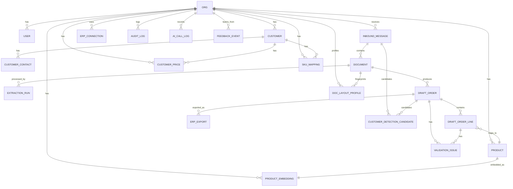

# SSOT_SPEC.md — OrderFlow: AI‑Auftragseingang Autopilot (DACH)

**Dokumenttyp:** Single Source of Truth (SSOT) — dieses Dokument ist die *einzige* Grundlage für Implementierung, Tests, Deployment und Betrieb.  
**Produktname:** OrderFlow  
**Version:** 1.0 (Final)  
**Stand:** 2025‑12‑26  
**Geltungsbereich:** MVP → skalierbares Fundament für Multi‑ERP, Multi‑Channel und Auto‑Confirm.

---

## 0. SSOT‑Regeln

1. **Keine externen Referenzen** sind nötig, um *OrderFlow* zu bauen. Bibliotheken/Frameworks dürfen genutzt werden, aber alle *Systemanforderungen, Datenmodelle, Endpunkte, Zustände, Regeln, Testfälle und Akzeptanzkriterien* sind **hier** definiert.
2. Bei Konflikten gilt: **Dieses Dokument > Code > Kommentare > Tickets**.
3. Änderungen am System werden ausschließlich durch Updates dieses Dokuments versioniert (Changelog unten).
4. **AI‑Layer ist deterministisch kontrolliert**: Jede LLM/Embedding‑Komponente ist über Provider‑Interfaces gekapselt, validiert und fallback‑fähig.

### 0.1 Changelog
- 1.0 (2025‑12‑26): Initiale vollständige Spezifikation inkl. AI‑Layer (LLM Extraktion, Embeddings, Confidence, Customer Detection, Learning Loop).

---

## 1. Vision & Ziel

### 1.1 Problem
B2B‑Bestellungen treffen häufig als **E‑Mail‑Anhänge (PDF/Excel/CSV)** oder schriftlich ein. Positionen werden manuell ins ERP übertragen — langsam, fehleranfällig, teuer. Besonders im DACH‑Großhandel erschweren **kundenspezifische Preise**, **Staffeln**, **Rabatte**, **UoM‑Konvertierungen** und **SKU‑Wildwuchs** eine Automatisierung.

### 1.2 Lösung
OrderFlow automatisiert den Auftragseingang als **Autopilot mit “Draft Sales Order”‑Wedge**:
1. Bestellungen per **E‑Mail‑Forwarding** oder **Upload** empfangen
2. Anhänge **speichern**, **extrahieren** (PDF/Excel/CSV)
3. Kunden‑SKUs **lernend mappen** auf interne Artikelnummern
4. **Validieren** (Produkt existiert, UoM kompatibel, Preislogik/Staffel gegen Import‑Preislisten, optional Verfügbarkeit)
5. **Draft** in UI zur Freigabe
6. Per Klick **in ERP übertragen** (MVP: per standardisiertem Export/Dropzone‑Connector)

### 1.3 Zielnutzer & Rollen
**Kunde von OrderFlow (Tenant):** Großhändler/Distributor  
**Primäre Nutzerrollen:**
- **Ops (Auftragssachbearbeitung):** Inbox triagieren, Draft prüfen, mappen, freigeben, pushen
- **Admin (Org‑Admin):** Nutzerverwaltung, Konfiguration, Import/Connector, Regeln
- **Integrator (IT/ERP Owner):** Connector‑Setup, Dropzone/Agent, Datenimporte, Monitoring
- **Viewer:** Lesen/Audit

### 1.4 Erfolgskriterien (messbar)
MVP‑Erfolg (pro Organisation, nach 4–8 Wochen Nutzung):
- **≥ 60%** der Aufträge werden als Draft mit **≥ 80%** korrekt extrahierten Positionen erstellt (bei Excel/CSV höher, bei PDF abhängig)
- **≥ 50%** der Positionen werden **automatisch** korrekt auf interne SKUs gematcht (steigend durch Lernen)
- **≥ 30%** Reduktion der manuellen Erfassungszeit (Median)
- **≤ 1%** kritische Fehler (falsche SKU/Qty/Preis) nach Freigabe (durch UI‑Review + Validierungen)
- **P95 UI‑Antwortzeiten** für Standard‑API‑Calls < 500 ms (ohne Datei‑Download)

### 1.5 Nicht‑Ziele (bewusst out of scope im MVP)
- Vollautomatisches Buchen ohne Freigabe (“Auto‑Post”)  
- Vollständige Abdeckung aller ERPs über native APIs  
- Vollständige Abdeckung aller Rabatt‑/Bonus‑/Konditionsmodelle (MVP: Staffelpreise + kundenspezifische Net‑Preise aus Import)  
- Elektronische Kanäle wie EDI/XML als primärer Kanal (Extension später)

---

## 2. Produktumfang & Kern-Workflows

### 2.1 Kernobjekte
- **Inbound Message:** Eingehende E‑Mail oder Upload‑Event
- **Document:** Anhang/Datei (PDF/Excel/CSV)
- **Extraction Run:** Verarbeitung eines Dokuments → strukturierte Daten
- **Draft Order:** Auftragsentwurf mit Header + Lines + Validierungsissues
- **SKU Mapping:** Lernende Zuordnung CustomerSKU → InternalSKU (+UoM/Pack)
- **ERP Export:** Ergebnis des “Push to ERP”‑Workflows
- **AI Call Log:** Protokoll für LLM/Embedding Calls (Kosten/Latency/Fehler)
- **Feedback Event:** Nutzereingriffe als Trainings-/Tuning‑Signale (ohne externes Training im MVP)

### 2.2 MVP‑Workflow (Happy Path)
1. Kunde forwarded Bestellung an inbound Adresse
2. OrderFlow speichert E‑Mail + Anhänge
3. Worker extrahiert → Draft Order
4. Customer Detection läuft → Kunde vorgeschlagen (oder Auswahl nötig)
5. Matching läuft automatisch → Kandidaten + Confidence
6. Ops prüft Draft, behebt Issues, bestätigt Mappings
7. Ops klickt “Approve & Push”
8. Connector erzeugt Exportfile und legt es in Dropzone ab
9. Status wird auf “PUSHED” gesetzt (oder “SENT” mit späterer Bestätigung)

---

## 3. Architektur

### 3.1 Leitprinzipien
- **Modular Monolith + Worker + Ingest** (nicht “Microservices um jeden Preis”)
- **Hexagonale Architektur (Ports & Adapters)**: Domain/Use‑Cases unabhängig von Infrastruktur
- **Event‑getriebene Verarbeitung** für asynchrone Pipelines (Extraction/CustomerDetect/Matching/Validation/Export)
- **Idempotenz** überall in Processing‑Jobs
- **Multi‑Tenant** von Anfang an (Daten strikt getrennt via `org_id`)
- **Beobachtbarkeit** (Logs/Tracing/Metriken) als First‑Class Feature
- **Erweiterungspunkte**: Email‑Channel, Extractor (Rule/LLM), Matcher (Trigram/Embedding/Hybrid), Validator, ERP‑Connector

### 3.2 Tech Stack (begründet)
**Backend**
- **Python 3.12 + FastAPI**: sehr gut für Document/AI‑Pipelines, schnelle API‑Entwicklung, starkes Typing via Pydantic
- **SQLAlchemy 2.x + Alembic**: migrationsfähig, testbar
- **Celery + Redis**: robuste Hintergrundjobs, Skalierung über Worker‑Pools
- **PostgreSQL 16**: relational + JSONB + Volltext + trigram + **pgvector** für Embeddings
- **Object Storage (S3 kompatibel, z.B. MinIO lokal / S3 prod)**: Anhänge, Renderings, Exports
- **Optional OCR Engine (MVP optional, empfohlen):** Tesseract für gescannte PDFs (Fallback), ansonsten multimodales LLM

**Frontend**
- **Next.js (React) + TypeScript**: UI‑Produktivität, SSR optional
- **TanStack Query**: Cache/Retry/Invalidation
- **DataGrid + PDF Viewer** (Open‑Source Komponente, konkrete Wahl implementierungsseitig)

**Beobachtbarkeit**
- Strukturierte JSON‑Logs
- OpenTelemetry Tracing (API + Worker)
- Prometheus Metrics Endpoint
- Sentry‑kompatibles Error Tracking (optional)

**Warum dieser Stack:**  
Er minimiert Risiko bei Dokumentverarbeitung, erlaubt klare Modultrennung, ist cloud‑fähig und im MVP schnell lieferbar, ohne spätere Skalierung zu blockieren.

### 3.3 Systemübersicht (Komponenten)

```mermaid
flowchart LR
  U[Ops/Admin im Browser] -->|HTTPS| FE[Frontend (Next.js)]
  FE -->|REST/JSON| API[OrderFlow API (FastAPI)]

  SMTP[SMTP Ingest Service] -->|Store raw MIME + metadata| API
  API --> DB[(PostgreSQL + pgvector + pg_trgm)]
  API --> OBJ[(Object Storage)]

  API -->|enqueue jobs| Q[(Redis/Celery Broker)]
  Q --> W[Worker Pool (Celery)]

  W --> DB
  W --> OBJ
  W --> LLM[LLM Provider (Port/Adapter)]
  W --> EMB[Embedding Provider (Port/Adapter)]
  W -->|export| DROP[ERP Dropzone (SFTP/SMB/FS)]
  DROP -->|optional ack| W

  API --> OBS[Observability: Logs/Traces/Metrics]
  W --> OBS
  SMTP --> OBS
```

### 3.4 Datenfluss (Order‑Intake Pipeline)

```mermaid
sequenceDiagram
  participant Customer as Kunde (Buyer)
  participant Mail as Forwarding Mailserver
  participant SMTP as SMTP Ingest
  participant API as OrderFlow API
  participant OBJ as Object Storage
  participant DB as PostgreSQL
  participant W as Worker
  participant LLM as LLM Provider
  participant EMB as Embedding Provider

  Customer->>Mail: Sendet PO per E-Mail (PDF/Excel/CSV)
  Mail->>SMTP: Forward an org-inbound@orderflow
  SMTP->>OBJ: raw MIME speichern
  SMTP->>API: InboundMessage + Documents anlegen
  API->>DB: persist inbound + docs
  API->>W: Job: process_document(document_id)

  W->>OBJ: Datei laden
  W->>W: Extraktion (Rule-Based; PDF ggf. LLM)
  alt PDF schwierig / gescannt
    W->>LLM: extract_order(...)
    LLM-->>W: structured JSON
  end

  W->>DB: DraftOrder + Lines speichern
  W->>W: Customer Detection (email+doc+LLM hint)
  W->>DB: customer candidates + best guess

  W->>EMB: embeddings (products/line queries) falls nötig
  EMB-->>W: vectors
  W->>DB: product embeddings / search
  W->>W: Matching + Validierung
  W->>DB: Updates + ValidationIssues + Confidence
```

### 3.5 Erweiterungspunkte (Ports)
- **InboundChannelPort**: Email, Upload, später EDI/API
- **ExtractorPort**: PDF/Excel/CSV Extractor (Rule‑Based + **LLM**)
- **LLMProviderPort**: Anbieter‑Adapter (z.B. OpenAI/Anthropic/Local)
- **EmbeddingProviderPort**: Anbieter‑Adapter (z.B. OpenAI/local)
- **MatcherPort**: SKU Matching Strategie (trigram/embedding/hybrid)
- **ValidatorPort**: Regelsets (Preis, UoM, Verfügbarkeit, Lieferbedingungen)
- **ERPConnectorPort**: Export/Push/Status‑Sync

---

## 4. Domänenmodule & Verantwortlichkeiten

### 4.1 Modulübersicht
1. **tenancy**: Organisationen, Mandantentrennung, Settings
2. **auth**: Login, Tokens, Rollen, Sessions
3. **inbox**: InboundMessages (E‑Mail/Upload), Dedup, Status
4. **documents**: Dateien, Storage, Rendering/Preview, Hashing
5. **extraction**: Extraktionsläufe, Parser, Confidence, LLM‑Fallback
6. **draft_orders**: DraftOrder Header/Lines, State Machine, Approvals
7. **catalog**: Produkte, UoM, Kunden, Preislisten, Import
8. **matching**: SKU Mapping, Vorschläge, Lernen, Hybrid Search
9. **validation**: Issues, Regeln, Overrides
10. **connectors**: ERP Export, Dropzone, Ack Handling
11. **ai**: Provider‑Ports, Call Logs, Embedding Jobs, Layout Fingerprints
12. **customer_detection**: Signals, Candidate Ranking, Ambiguity Handling
13. **feedback**: Feedback Events, Learning Loop, Metrics
14. **audit**: AuditLog, Events
15. **notifications** (MVP minimal): interne UI‑Notifications/Toasts, optional Email später

---

## 5. Datenmodell

### 5.1 Konventionen
- Alle Tabellen enthalten: `id UUID PRIMARY KEY`, `org_id UUID NOT NULL` (außer globalen Systemtabellen), `created_at`, `updated_at`
- Multi‑Tenant Isolation: *jede* Query filtert `org_id`; API erzwingt dies serverseitig.
- Soft‑Delete: optional via `deleted_at` nur dort, wo nötig; MVP: harte Deletes nur für nicht‑produktive Objekte (Testdaten), sonst Soft‑Delete für Kunden/Produkte/Mappings.

### 5.2 Enumerationen (SSOT)
#### 5.2.1 Rollen
- `ADMIN`
- `INTEGRATOR`
- `OPS`
- `VIEWER`

#### 5.2.2 InboundMessageStatus
- `RECEIVED` (angelegt)
- `STORED` (raw MIME/file gespeichert)
- `PARSED` (Attachments extrahiert)
- `FAILED`

#### 5.2.3 DocumentStatus
- `UPLOADED`
- `STORED`
- `PROCESSING`
- `EXTRACTED`
- `FAILED`

#### 5.2.4 ExtractionRunStatus
- `PENDING`
- `RUNNING`
- `SUCCEEDED`
- `FAILED`

#### 5.2.5 DraftOrderStatus (State Machine)
- `NEW` (angelegt, noch ohne Daten)
- `EXTRACTED` (Extraktion abgeschlossen)
- `NEEDS_REVIEW` (Issues oder Low Confidence)
- `READY` (alle Pflichtfelder ok, keine blockierenden Issues)
- `APPROVED` (User freigegeben)
- `PUSHING`
- `PUSHED`
- `REJECTED`
- `ERROR`

**State‑Transitions (erlaubt):**
- `NEW -> EXTRACTED`
- `EXTRACTED -> NEEDS_REVIEW | READY`
- `NEEDS_REVIEW -> READY | REJECTED`
- `READY -> APPROVED`
- `APPROVED -> PUSHING`
- `PUSHING -> PUSHED | ERROR`
- `ERROR -> NEEDS_REVIEW | PUSHING` (Retry)
- `REJECTED` ist terminal (MVP)

#### 5.2.6 ValidationIssueSeverity
- `INFO` (Hinweis)
- `WARNING` (nicht blockierend)
- `ERROR` (blockierend für READY)

#### 5.2.7 ValidationIssueStatus
- `OPEN`
- `ACKNOWLEDGED`
- `RESOLVED`
- `OVERRIDDEN`

#### 5.2.8 MappingStatus
- `SUGGESTED`
- `CONFIRMED`
- `REJECTED`
- `DEPRECATED`

#### 5.2.9 ERPExportStatus
- `PENDING`
- `SENT`
- `ACKED`
- `FAILED`

#### 5.2.10 AICallType
- `LLM_EXTRACT_PDF_TEXT`
- `LLM_EXTRACT_PDF_VISION`
- `LLM_REPAIR_JSON`
- `EMBED_PRODUCT`
- `EMBED_QUERY`
- `LLM_CUSTOMER_HINT`

#### 5.2.11 CustomerDetectionStatus
- `CANDIDATE`
- `SELECTED`
- `REJECTED`

### 5.3 ER‑Diagramm



### 5.4 Tabellen (Schemas)

> **Hinweis:** Felder sind *verpflichtend*, wenn nicht als optional markiert.

#### 5.4.1 `org`
- `id` UUID
- `name` TEXT
- `slug` TEXT UNIQUE (für UI/URLs)
- `settings_json` JSONB (Org‑Konfig, siehe §10)
- `created_at` TIMESTAMPTZ
- `updated_at` TIMESTAMPTZ

**Indexing**
- UNIQUE(`slug`)

#### 5.4.2 `user`
- `id` UUID
- `org_id` UUID (FK org)
- `email` CITEXT (case‑insensitive) UNIQUE pro org
- `name` TEXT
- `role` ENUM(Role)
- `password_hash` TEXT (Argon2id)
- `status` TEXT (`ACTIVE`/`DISABLED`)
- `last_login_at` TIMESTAMPTZ NULL
- `created_at`, `updated_at`

**Indexing**
- UNIQUE(`org_id`, `email`)
- INDEX(`org_id`, `role`)

#### 5.4.3 `customer`
- `id` UUID
- `org_id` UUID
- `name` TEXT
- `erp_customer_number` TEXT NULL (ID im ERP; MVP optional)
- `default_currency` TEXT (ISO 4217, z.B. `EUR`, `CHF`)
- `default_language` TEXT (BCP47, z.B. `de-DE`)
- `billing_address_json` JSONB NULL
- `shipping_address_json` JSONB NULL
- `metadata_json` JSONB NULL (z.B. Rabattgruppe)
- `created_at`, `updated_at`

**Indexing**
- INDEX(`org_id`, `name`)
- INDEX(`org_id`, `erp_customer_number`)

#### 5.4.4 `customer_contact`
- `id` UUID
- `org_id` UUID
- `customer_id` UUID
- `email` CITEXT
- `name` TEXT NULL
- `is_primary` BOOLEAN DEFAULT false
- `created_at`, `updated_at`

**Indexing**
- INDEX(`org_id`, `customer_id`)
- UNIQUE(`customer_id`, `email`)

#### 5.4.5 `inbound_message`
- `id` UUID
- `org_id` UUID
- `source` TEXT (`EMAIL` | `UPLOAD`)
- `source_message_id` TEXT NULL (Message‑ID / Upload‑ID)
- `from_email` CITEXT NULL
- `to_email` CITEXT NULL
- `subject` TEXT NULL
- `received_at` TIMESTAMPTZ NOT NULL
- `raw_storage_key` TEXT NULL (Object Storage key, bei EMAIL raw MIME)
- `status` ENUM(InboundMessageStatus)
- `error_json` JSONB NULL
- `created_at`, `updated_at`

**Indexing**
- INDEX(`org_id`, `received_at` DESC)
- INDEX(`org_id`, `status`)
- UNIQUE(`org_id`, `source`, `source_message_id`) WHERE `source_message_id` IS NOT NULL

#### 5.4.6 `document`
- `id` UUID
- `org_id` UUID
- `inbound_message_id` UUID NULL (bei Upload vorhanden, aber source UPLOAD)
- `file_name` TEXT
- `mime_type` TEXT
- `size_bytes` BIGINT
- `sha256` TEXT (hex)
- `storage_key` TEXT (Object Storage key für Original)
- `preview_storage_key` TEXT NULL (z.B. gerenderte PDF‑Vorschau/Thumbnails)
- `extracted_text_storage_key` TEXT NULL (Textdump für Debug/LLM)
- `status` ENUM(DocumentStatus)
- `page_count` INT NULL
- `text_coverage_ratio` NUMERIC(4,3) NULL  (0..1; bei PDF)
- `layout_fingerprint` TEXT NULL (sha256; siehe `doc_layout_profile`)
- `error_json` JSONB NULL
- `created_at`, `updated_at`

**Indexing**
- INDEX(`org_id`, `created_at` DESC)
- INDEX(`org_id`, `sha256`)
- UNIQUE(`org_id`, `sha256`, `file_name`, `size_bytes`) (Dedup‑Heuristik)

#### 5.4.7 `extraction_run`
- `id` UUID
- `org_id` UUID
- `document_id` UUID
- `extractor_version` TEXT (z.B. `rule_v1`, `llm_v1`)
- `status` ENUM(ExtractionRunStatus)
- `started_at` TIMESTAMPTZ NULL
- `finished_at` TIMESTAMPTZ NULL
- `metrics_json` JSONB NULL (z.B. runtime_ms, tokens, pages)
- `error_json` JSONB NULL
- `created_at`, `updated_at`

**Indexing**
- INDEX(`org_id`, `document_id`, `created_at` DESC)

#### 5.4.8 `draft_order`
- `id` UUID
- `org_id` UUID
- `customer_id` UUID NULL (kann erst nach Detection/Manuell gesetzt werden)
- `inbound_message_id` UUID NULL
- `document_id` UUID NOT NULL
- `external_order_number` TEXT NULL (Bestellnummer des Kunden)
- `order_date` DATE NULL
- `currency` TEXT NULL
- `requested_delivery_date` DATE NULL
- `ship_to_json` JSONB NULL
- `bill_to_json` JSONB NULL
- `notes` TEXT NULL
- `status` ENUM(DraftOrderStatus)
- `confidence_score` NUMERIC(4,3) NOT NULL DEFAULT 0.000  (0..1; siehe §7.8)
- `extraction_confidence` NUMERIC(4,3) NOT NULL DEFAULT 0.000
- `customer_confidence` NUMERIC(4,3) NOT NULL DEFAULT 0.000
- `matching_confidence` NUMERIC(4,3) NOT NULL DEFAULT 0.000
- `ready_check_json` JSONB NOT NULL DEFAULT '{}' (Ergebnis Ready‑Check)
- `customer_candidates_json` JSONB NOT NULL DEFAULT '[]' (UI quick display; Quelle bleibt `customer_detection_candidate`)
- `approved_by_user_id` UUID NULL
- `approved_at` TIMESTAMPTZ NULL
- `erp_order_id` TEXT NULL (nach Push)
- `created_at`, `updated_at`

**Indexing**
- INDEX(`org_id`, `status`)
- INDEX(`org_id`, `created_at` DESC)
- INDEX(`org_id`, `customer_id`)

#### 5.4.9 `draft_order_line`
- `id` UUID
- `org_id` UUID
- `draft_order_id` UUID
- `line_no` INT NOT NULL
- `customer_sku_raw` TEXT NULL
- `customer_sku_norm` TEXT NULL
- `product_description` TEXT NULL (extrahiert)
- `qty` NUMERIC(18,3) NULL
- `uom` TEXT NULL (z.B. `ST`, `M`, `KG`, `KAR`)
- `unit_price` NUMERIC(18,4) NULL
- `currency` TEXT NULL
- `internal_sku` TEXT NULL (FK logisch zu product.internal_sku)
- `match_status` TEXT (`UNMATCHED`|`SUGGESTED`|`MATCHED`|`OVERRIDDEN`)
- `match_confidence` NUMERIC(4,3) NOT NULL DEFAULT 0.000 (siehe §7.9)
- `match_method` TEXT NULL (z.B. `exact_mapping`, `trigram`, `embedding`, `hybrid`, `manual`)
- `match_debug_json` JSONB NOT NULL DEFAULT '{}' (Scores/Features)
- `requested_delivery_date` DATE NULL
- `line_notes` TEXT NULL
- `created_at`, `updated_at`

**Indexing**
- INDEX(`org_id`, `draft_order_id`)
- INDEX(`org_id`, `internal_sku`)
- INDEX(`org_id`, `customer_sku_norm`)
- UNIQUE(`draft_order_id`, `line_no`)

#### 5.4.10 `product`
- `id` UUID
- `org_id` UUID
- `internal_sku` TEXT NOT NULL
- `name` TEXT NOT NULL
- `description` TEXT NULL
- `base_uom` TEXT NOT NULL (z.B. `ST`)
- `uom_conversions_json` JSONB NOT NULL DEFAULT '{}'  
  Beispiel: `{ "KAR": { "to_base": 12 }, "PAL": { "to_base": 480 } }`
- `active` BOOLEAN NOT NULL DEFAULT true
- `attributes_json` JSONB NOT NULL DEFAULT '{}' (z.B. Hersteller, EAN, Warengruppe)
- `updated_source_at` TIMESTAMPTZ NULL (wann zuletzt importiert)
- `created_at`, `updated_at`

**Indexing**
- UNIQUE(`org_id`, `internal_sku`)
- INDEX(`org_id`, `active`)
- Optional: FULLTEXT Index auf (`name`, `description`) für Suche

#### 5.4.11 `customer_price`
- `id` UUID
- `org_id` UUID
- `customer_id` UUID
- `internal_sku` TEXT
- `currency` TEXT NOT NULL
- `uom` TEXT NOT NULL
- `unit_price` NUMERIC(18,4) NOT NULL
- `min_qty` NUMERIC(18,3) NOT NULL DEFAULT 1 (Staffel)
- `valid_from` DATE NULL
- `valid_to` DATE NULL
- `source` TEXT NOT NULL DEFAULT 'IMPORT'
- `created_at`, `updated_at`

**Indexing**
- INDEX(`org_id`, `customer_id`, `internal_sku`)
- INDEX(`org_id`, `customer_id`, `internal_sku`, `min_qty`)

#### 5.4.12 `sku_mapping`
- `id` UUID
- `org_id` UUID
- `customer_id` UUID
- `customer_sku_norm` TEXT NOT NULL
- `customer_sku_raw_sample` TEXT NULL (Beispiel)
- `internal_sku` TEXT NOT NULL
- `uom_from` TEXT NULL (Customer‑UoM)
- `uom_to` TEXT NULL (Internal‑UoM)
- `pack_factor` NUMERIC(18,6) NULL (wenn z.B. 1 KAR = 12 ST)
- `status` ENUM(MappingStatus)
- `confidence` NUMERIC(4,3) NOT NULL DEFAULT 1.000 (für CONFIRMED)
- `support_count` INT NOT NULL DEFAULT 1 (wie oft bestätigt/benutzt)
- `reject_count` INT NOT NULL DEFAULT 0
- `last_used_at` TIMESTAMPTZ NULL
- `created_by_user_id` UUID NULL
- `created_at`, `updated_at`

**Indexing**
- UNIQUE(`org_id`, `customer_id`, `customer_sku_norm`) WHERE status IN ('CONFIRMED','SUGGESTED')
- INDEX(`org_id`, `customer_id`, `internal_sku`)

#### 5.4.13 `validation_issue`
- `id` UUID
- `org_id` UUID
- `draft_order_id` UUID
- `draft_order_line_id` UUID NULL
- `type` TEXT (SSOT‑Issue‑Typen siehe §7.3)
- `severity` ENUM(ValidationIssueSeverity)
- `status` ENUM(ValidationIssueStatus)
- `message` TEXT
- `details_json` JSONB NOT NULL DEFAULT '{}'
- `created_at`, `updated_at`
- `resolved_by_user_id` UUID NULL
- `resolved_at` TIMESTAMPTZ NULL

**Indexing**
- INDEX(`org_id`, `draft_order_id`, `status`)
- INDEX(`org_id`, `severity`, `status`)

#### 5.4.14 `erp_connection`
- `id` UUID
- `org_id` UUID
- `connector_type` TEXT (MVP: `DROPZONE_JSON_V1`)
- `config_encrypted` BYTEA (verschlüsselt, siehe §11 Security)
- `status` TEXT (`ACTIVE`|`DISABLED`)
- `last_test_at` TIMESTAMPTZ NULL
- `created_at`, `updated_at`

**Indexing**
- UNIQUE(`org_id`, `connector_type`) (MVP: 1 aktiv)

#### 5.4.15 `erp_export`
- `id` UUID
- `org_id` UUID
- `erp_connection_id` UUID
- `draft_order_id` UUID
- `export_format_version` TEXT (z.B. `orderflow_export_json_v1`)
- `export_storage_key` TEXT (Object Storage key)  
- `dropzone_path` TEXT NULL (Zielpfad, debug)
- `status` ENUM(ERPExportStatus)
- `erp_order_id` TEXT NULL
- `error_json` JSONB NULL
- `created_at`, `updated_at`

**Indexing**
- INDEX(`org_id`, `draft_order_id`, `created_at` DESC)

#### 5.4.16 `audit_log`
- `id` UUID
- `org_id` UUID
- `actor_user_id` UUID NULL (Systemaktionen: NULL)
- `action` TEXT (z.B. `DRAFT_APPROVED`, `MAPPING_CONFIRMED`)
- `entity_type` TEXT
- `entity_id` UUID
- `before_json` JSONB NULL
- `after_json` JSONB NULL
- `ip` TEXT NULL
- `user_agent` TEXT NULL
- `created_at` TIMESTAMPTZ

**Indexing**
- INDEX(`org_id`, `created_at` DESC)
- INDEX(`org_id`, `entity_type`, `entity_id`)

---

### 5.5 AI‑Layer Tabellen (neu)

#### 5.5.1 `ai_call_log`
Protokolliert Kosten/Latency/Fehler für jeden AI‑Call. Dient für Budget‑Kontrolle, Debug, Qualität.

- `id` UUID
- `org_id` UUID
- `call_type` ENUM(AICallType)
- `provider` TEXT (z.B. `openai`, `anthropic`, `local`)
- `model` TEXT (z.B. `gpt-4o-mini`)
- `request_id` TEXT NULL (API request id oder job id)
- `document_id` UUID NULL
- `draft_order_id` UUID NULL
- `input_hash` TEXT NOT NULL (sha256 der canonicalisierten Inputs; Idempotenz)
- `prompt_template` TEXT NULL (z.B. `pdf_extract_v1`)
- `tokens_in` INT NULL
- `tokens_out` INT NULL
- `latency_ms` INT NULL
- `cost_micros` BIGINT NULL (in Mikro‑Währungseinheiten, z.B. 1e‑6 EUR)
- `status` TEXT (`SUCCEEDED`|`FAILED`)
- `error_json` JSONB NULL
- `created_at`, `updated_at`

**Indexing**
- INDEX(`org_id`, `created_at` DESC)
- INDEX(`org_id`, `document_id`)
- UNIQUE(`org_id`, `call_type`, `input_hash`) WHERE status = 'SUCCEEDED'

#### 5.5.2 `product_embedding`
Speichert Vektor je Produkt (für semantisches Matching).

- `id` UUID
- `org_id` UUID
- `product_id` UUID (FK product)
- `embedding_model` TEXT NOT NULL (z.B. `text-embedding-3-small`)
- `embedding_dim` INT NOT NULL DEFAULT 1536
- `embedding` VECTOR(1536) NOT NULL  (**pgvector**)
- `text_hash` TEXT NOT NULL (sha256 des eingebetteten Textes; Recompute‑Trigger)
- `updated_at_source` TIMESTAMPTZ NULL (wann der Produkttext zuletzt geändert wurde)
- `created_at`, `updated_at`

**Indexing**
- UNIQUE(`org_id`, `product_id`, `embedding_model`)
- VECTOR INDEX: `HNSW (embedding) WITH (m=16, ef_construction=200)` using cosine distance

#### 5.5.3 `doc_layout_profile`
Layout‑Fingerprinting für PDFs (für Prompt‑Few‑Shot & Analytics). Kein automatisches Training im MVP, aber Speicherung ist Pflicht.

- `id` UUID
- `org_id` UUID
- `layout_fingerprint` TEXT NOT NULL (sha256)
- `document_id` UUID NOT NULL
- `fingerprint_method` TEXT NOT NULL (`PDF_TEXT_SHA256`|`PDF_IMAGE_PHASH`)
- `anchors_json` JSONB NOT NULL DEFAULT '{}'  
  Beispiel: `{ "keywords": ["Bestellnummer", "Pos"], "page_count": 2, "text_chars": 4800 }`
- `seen_count` INT NOT NULL DEFAULT 1
- `last_seen_at` TIMESTAMPTZ NOT NULL
- `created_at`, `updated_at`

**Indexing**
- UNIQUE(`org_id`, `layout_fingerprint`)
- INDEX(`org_id`, `last_seen_at` DESC)

#### 5.5.4 `customer_detection_candidate`
Kandidatenliste für Customer Detection (für UI‑Auswahl & Audit).

- `id` UUID
- `org_id` UUID
- `inbound_message_id` UUID NULL
- `draft_order_id` UUID NULL
- `customer_id` UUID NOT NULL
- `score` NUMERIC(4,3) NOT NULL
- `signals_json` JSONB NOT NULL DEFAULT '{}'  
  Beispiel: `{ "from_email_exact": true, "domain_match": false, "doc_erp_number": "4711", "llm_hint_name": "Muster GmbH" }`
- `status` ENUM(CustomerDetectionStatus) NOT NULL DEFAULT 'CANDIDATE'
- `created_at`, `updated_at`

**Indexing**
- INDEX(`org_id`, `draft_order_id`, `score` DESC)
- INDEX(`org_id`, `inbound_message_id`, `score` DESC)

#### 5.5.5 `feedback_event`
Speichert Nutzer‑Feedback (Korrekturen/Bestätigungen) für Learning Loop & Qualität. Kein externes Training im MVP; dient für Regeln/Prompt‑Examples/Reweighting.

- `id` UUID
- `org_id` UUID
- `actor_user_id` UUID NULL
- `event_type` TEXT NOT NULL  
  SSOT‑Liste:
  - `MAPPING_CONFIRMED`
  - `MAPPING_REJECTED`
  - `EXTRACTION_FIELD_CORRECTED`
  - `EXTRACTION_LINE_CORRECTED`
  - `CUSTOMER_SELECTED`
  - `ISSUE_OVERRIDDEN`
- `document_id` UUID NULL
- `draft_order_id` UUID NULL
- `draft_order_line_id` UUID NULL
- `layout_fingerprint` TEXT NULL
- `before_json` JSONB NULL
- `after_json` JSONB NULL
- `meta_json` JSONB NOT NULL DEFAULT '{}' (z.B. method, confidence, reason)
- `created_at`, `updated_at`

**Indexing**
- INDEX(`org_id`, `created_at` DESC)
- INDEX(`org_id`, `event_type`, `created_at` DESC)
- INDEX(`org_id`, `layout_fingerprint`)

---

## 6. Domainregeln (Business Logic)

### 6.1 Normalisierung Customer SKU
**Funktion:** `normalize_customer_sku(raw: str) -> str`
- Trim
- Uppercase
- Ersetze `\t`, `\n`, Mehrfach‑Spaces durch single Space
- Entferne alle Zeichen außer `[A-Z0-9]`  
  (d.h. `-`, `.`, `/`, Leerzeichen werden entfernt)
- Ergebnis darf leer sein; dann gilt SKU als “missing”.

**Beispiel**
- `" AB-12 / 34 "` → `"AB1234"`

### 6.2 UoM Standardisierung
**Canonical UoM Codes (SSOT‑Liste)**  
- `ST` (Stück)
- `M` (Meter)
- `CM` (Zentimeter)
- `MM` (Millimeter)
- `KG` (Kilogramm)
- `G` (Gramm)
- `L` (Liter)
- `ML` (Milliliter)
- `KAR` (Karton)
- `PAL` (Palette)
- `SET` (Set)

**UoM Mapping Eingangsseite (Beispiele)**
- `Stk`, `Stück`, `pcs` → `ST`
- `m`, `Meter` → `M`
- `kg`, `Kilogramm` → `KG`
- `ctn`, `karton` → `KAR`

**Regel:** Jeder Extractor muss UoM auf Canonical Codes mappen. Unbekannt → `NULL` + ValidationIssue.

### 6.3 “Ready”‑Check (blockierend)
Ein DraftOrder darf Status `READY` nur erhalten, wenn:
- Header:
  - `customer_id` gesetzt (oder im MVP: *manuell wählbar*, aber READY erfordert gesetzt)
  - `currency` gesetzt
- Lines (für jede Zeile):
  - `qty` gesetzt und > 0
  - `uom` gesetzt
  - `internal_sku` gesetzt (oder explizit durch Ops als “unmatched allowed” markiert — MVP: **nicht erlaubt**, d.h. blockierend)
- Keine offenen Issues mit `severity = ERROR`

**Output:** `ready_check_json` enthält:
```json
{
  "is_ready": true,
  "blocking_reasons": [],
  "checked_at": "2025-12-26T12:00:00Z"
}
```

### 6.4 Approve‑Regeln
- Approve setzt `status = APPROVED`, `approved_by_user_id`, `approved_at`.
- Approve ist nur erlaubt, wenn `status = READY`.

### 6.5 Push‑Regeln
- Push ist nur erlaubt, wenn `status = APPROVED`.
- Push ist idempotent pro DraftOrder: wenn bereits `PUSHED` oder `PUSHING` mit aktivem Export, wird derselbe Export zurückgegeben oder es erfolgt `409 CONFLICT`.

---

## 7. Extraction, Matching, Customer Detection, Confidence & Learning (SSOT)

### 7.1 Extraction Output Schema (kanonisch)
Jede Extraktion (egal ob Rule‑Based oder LLM) muss in folgendes JSON überführen:

```json
{
  "order": {
    "external_order_number": "PO-12345",
    "order_date": "2025-12-01",
    "currency": "EUR",
    "requested_delivery_date": "2025-12-10",
    "customer_hint": {
      "name": "Muster GmbH",
      "email": "buyer@customer.de",
      "erp_customer_number": "4711"
    },
    "notes": "Bitte Express",
    "ship_to": { "company": "", "street": "", "zip": "", "city": "", "country": "DE" }
  },
  "lines": [
    {
      "line_no": 1,
      "customer_sku_raw": "AB-123",
      "product_description": "Kabel NYM-J 3x1,5",
      "qty": 10,
      "uom": "M",
      "unit_price": 1.23,
      "currency": "EUR",
      "requested_delivery_date": null
    }
  ],
  "confidence": {
    "order": {
      "external_order_number": 0.7,
      "order_date": 0.6,
      "currency": 0.9,
      "customer_hint": 0.5
    },
    "lines": [
      {
        "customer_sku_raw": 0.8,
        "qty": 0.9,
        "uom": 0.9,
        "unit_price": 0.6
      }
    ],
    "overall": 0.75
  },
  "warnings": [
    { "code": "MISSING_PRICE", "message": "Unit price not found for 2 lines." }
  ],
  "extractor_version": "rule_v1"
}
```

**Muss‑Regeln**
- `lines[].line_no` muss fortlaufend sein (1..n). Falls nicht extrahierbar: erzeugen.
- `currency` auf ISO 4217 normalisieren (`EUR`, `CHF`).
- `qty` numerisch; Dezimaltrennzeichen `,` muss unterstützt werden.
- Unbekannte Werte sind `null` (nicht halluzinieren).

---

### 7.2 Decision Logic: Rule‑Based vs. LLM (nur PDFs)
Rule‑Based ist Standard. LLM wird nur verwendet, wenn es sich **lohnt** oder **notwendig** ist.

**7.2.1 PDF Voranalyse (Pflicht)**
Beim Laden eines PDFs werden folgende Metriken berechnet:
- `page_count`
- `text_chars_total` (extrahierter Text, z.B. über PDF text extraction)
- `text_coverage_ratio = min(1, text_chars_total / (page_count * 2500))`  
  Interpretation: ~2500 Zeichen/Seite ≈ “textreich”.

**7.2.2 Entscheidung (SSOT)**
LLM wird verwendet, wenn **mindestens eine** Bedingung erfüllt ist:

A) **Gescannter/“image‑based” PDF Verdacht**
- `text_coverage_ratio < 0.15` **oder**
- `text_chars_total < 500` bei `page_count >= 1`
→ **LLM_VISION** (oder OCR + LLM_TEXT, siehe Fallback)

B) **Rule‑Based Ergebnis zu schwach**
Nach Rule‑Based Extraktion:
- `extraction_confidence < org.settings_json.ai.llm_trigger_extraction_confidence` (Default 0.60) **oder**
- `lines_count == 0` **oder**
- Anteil Lines ohne (sku oder description) > 0.50  
→ **LLM_TEXT** (wenn Text vorhanden), sonst **LLM_VISION**

C) **Expliziter User‑Trigger**
- Ops klickt “Retry with AI” im Draft (nur wenn status NEEDS_REVIEW)  
→ **LLM_TEXT/VISION** je nach Text‑Coverage.

**7.2.3 Kosten-/Latency‑Gate (SSOT)**
LLM‑Call wird **abgebrochen** (und fällt auf Manual), wenn:
- `page_count > org.settings_json.ai.pdf.max_pages_for_llm` (Default 20)
- geschätzte Tokens > `org.settings_json.ai.llm.max_estimated_tokens` (Default 40_000)
- Tagesbudget überschritten: `org.settings_json.ai.llm.daily_budget_micros` (Default 0 = unlimited)  
  (Budgettracking via `ai_call_log.cost_micros`)

**Token‑Schätzung**
- Text‑LLM: `estimated_tokens = ceil(len(text)/4)`
- Vision‑LLM: `estimated_tokens = 1500 * page_count` (konservativer Default)

---

### 7.3 Validation Issue Typen (SSOT‑Liste)
**Header‑Issues**
- `MISSING_CUSTOMER` (ERROR)
- `MISSING_CURRENCY` (ERROR)

**Line‑Issues**
- `MISSING_SKU` (ERROR)
- `UNKNOWN_PRODUCT` (ERROR)
- `MISSING_QTY` (ERROR)
- `INVALID_QTY` (ERROR)
- `MISSING_UOM` (ERROR)
- `UNKNOWN_UOM` (ERROR)
- `UOM_INCOMPATIBLE` (ERROR)
- `MISSING_PRICE` (WARNING) (MVP: warning; später kann error sein)
- `PRICE_MISMATCH` (WARNING/ERROR je Org‑Setting)
- `DUPLICATE_LINE` (WARNING) (gleiche SKU + qty + uom mehrfach)
- `LOW_CONFIDENCE_EXTRACTION` (WARNING)
- `LOW_CONFIDENCE_MATCH` (WARNING)
- `CUSTOMER_AMBIGUOUS` (ERROR) (neu; blockiert READY bis Auswahl)
- `LLM_OUTPUT_INVALID` (WARNING/ERROR je Situation; siehe §7.6)

---

### 7.4 Validation Regeln (MVP)
- **Product exists:** `internal_sku` muss in `product` existieren (sonst `UNKNOWN_PRODUCT`)
- **Qty valid:** qty > 0 (sonst `INVALID_QTY`)
- **UoM known:** uom ∈ Canonical UoM (sonst `UNKNOWN_UOM`)
- **UoM compatibility:**  
  - Wenn line.uom != product.base_uom:
    - erlaubt, wenn `product.uom_conversions_json` einen Eintrag für line.uom hat (sonst `UOM_INCOMPATIBLE`)
- **Price check (optional, wenn customer_prices vorhanden):**
  - Finde bestes Matching `customer_price` (max min_qty <= qty, valid range ok)
  - Wenn line.unit_price vorhanden:
    - Wenn abs(line.unit_price - expected) / expected > `price_tolerance_percent` → `PRICE_MISMATCH`
  - Wenn line.unit_price fehlt:
    - `MISSING_PRICE` (WARNING)

---

### 7.5 LLM‑basierte Extraktion für unstrukturierte PDFs (llm_v1)

#### 7.5.1 Provider‑Interface (Port)
**LLMProviderPort** (synchrone Signatur; in Worker async verwendet):

- `extract_order_from_pdf_text(text: str, context: dict) -> LLMExtractionResult`
- `extract_order_from_pdf_images(images: list[bytes], context: dict) -> LLMExtractionResult`
- `repair_invalid_json(previous_output: str, error: str, context: dict) -> str`

**LLMExtractionResult**
- `raw_output: str`
- `parsed_json: dict | null`
- `provider: str`
- `model: str`
- `tokens_in/out: int?`
- `latency_ms: int?`
- `cost_micros: int?`
- `warnings: list[str]`

#### 7.5.2 Modellwahl (SSOT)
Das System ist **provider‑abstrahiert**, hat aber eine **Default‑Policy**:

- **Text‑LLM Default:** `gpt-4o-mini`  
- **Vision‑LLM Default:** `gpt-4o` (nur wenn nötig; ansonsten `gpt-4o-mini` wenn Vision unterstützt)
- Alternative Provider (optional): `claude-*` oder local, **nur** wenn Adapter die gleichen Garantien erfüllt (Strict JSON + per‑field confidence + refusal to hallucinate).

**Konfigurierbar:** `org.settings_json.ai.llm.provider`, `...model_text`, `...model_vision`.

#### 7.5.3 Prompt Templates (konkret)

> **Wichtig:** Prompts sind SSOT. Die Implementierung muss sie exakt verwenden (mit Variablenersetzung).

##### Template `pdf_extract_text_v1`
**System**
```
You are an information extraction engine for B2B purchase orders.
Your job: extract a purchase order into STRICT JSON that matches the provided schema exactly.
Rules:
- Output ONLY JSON. No markdown. No explanations.
- If a field is unknown or not present, use null (do NOT invent).
- Keep original numbers as decimals. Use dot as decimal separator.
- Dates must be ISO format YYYY-MM-DD if present, else null.
- Currency must be ISO 4217 (EUR, CHF). If unclear, null.
- line_no must be 1..n sequential.
- For each line, if you cannot find customer_sku_raw and product_description, still create a line but set missing fields to null and lower confidence.
- Include per-field confidence 0..1 for required fields.
```

**User**
```
CONTEXT (do not output, only use):
- inbound_from_email: {{from_email}}
- inbound_subject: {{subject}}
- org_default_currency: {{default_currency}}
- canonical_uoms: ST,M,CM,MM,KG,G,L,ML,KAR,PAL,SET
- known_customer_numbers: {{known_customer_numbers_csv_or_empty}}
- hint_examples (optional): {{few_shot_examples_json_or_empty}}

TASK:
Extract the purchase order from the text below into STRICT JSON.

STRICT JSON SCHEMA (keys must match exactly):
{
  "order": {
    "external_order_number": string|null,
    "order_date": string|null,
    "currency": string|null,
    "requested_delivery_date": string|null,
    "customer_hint": {
      "name": string|null,
      "email": string|null,
      "erp_customer_number": string|null
    },
    "notes": string|null,
    "ship_to": { "company": string|null, "street": string|null, "zip": string|null, "city": string|null, "country": string|null }
  },
  "lines": [
    {
      "line_no": number,
      "customer_sku_raw": string|null,
      "product_description": string|null,
      "qty": number|null,
      "uom": string|null,
      "unit_price": number|null,
      "currency": string|null,
      "requested_delivery_date": string|null
    }
  ],
  "confidence": {
    "order": {
      "external_order_number": number,
      "order_date": number,
      "currency": number,
      "customer_hint": number
    },
    "lines": [
      { "customer_sku_raw": number, "qty": number, "uom": number, "unit_price": number }
    ],
    "overall": number
  },
  "warnings": [ { "code": string, "message": string } ],
  "extractor_version": "llm_v1"
}

PURCHASE ORDER TEXT:
<<<
{{pdf_text}}
>>>
```

##### Template `pdf_extract_vision_v1`
**System**
```
You are an information extraction engine for B2B purchase orders.
You will be given page images of a purchase order.
Extract into STRICT JSON matching the schema exactly.
Rules:
- Output ONLY JSON.
- Never invent values. Use null when unsure.
- Use ISO dates YYYY-MM-DD; currency ISO 4217.
- UoM must be one of the canonical codes if you can map it; else null.
- Provide per-field confidence 0..1.
```

**User**
```
CONTEXT (do not output):
- inbound_from_email: {{from_email}}
- inbound_subject: {{subject}}
- org_default_currency: {{default_currency}}
- canonical_uoms: ST,M,CM,MM,KG,G,L,ML,KAR,PAL,SET
- known_customer_numbers: {{known_customer_numbers_csv_or_empty}}
- hint_examples (optional): {{few_shot_examples_json_or_empty}}

TASK:
Extract the purchase order from these page images into STRICT JSON matching the schema (same as pdf_extract_text_v1).
Return ONLY JSON.

(Images attached separately by the system: page_1.png ... page_n.png)
```

##### Template `json_repair_v1`
**System**
```
You are a JSON repair tool.
You will receive invalid JSON that was intended to match a strict schema.
Return ONLY corrected JSON that:
- Is valid JSON
- Matches the schema keys exactly
- Keeps as much original content as possible
- Does not add invented values; use null if uncertain
No explanations.
```

**User**
```
SCHEMA (keys must match exactly): {{schema_json}}

INVALID JSON:
<<<
{{invalid_json}}
>>>

VALIDATION ERROR:
{{validation_error}}

Return ONLY corrected JSON.
```

#### 7.5.4 Structured Output Parsing (SSOT)
LLM Output wird **nie** direkt übernommen. Pipeline:

1. `raw_output` aus Provider
2. `strip_whitespace` und **verwerfen**, wenn Output nicht mit `{` beginnt
3. `json.loads` → falls fail → 1× `json_repair_v1` Call (type `LLM_REPAIR_JSON`)
4. Validierung gegen **Pydantic Modelle** (strict):
   - Unknown keys: **forbidden**
   - Types strikt: number vs string
   - `lines` max length: `org.settings_json.ai.extraction.max_lines` (Default 500)
5. Normalisierung:
   - UoM Mapping → canonical
   - Currency mapping
   - line_no neu durchzählen falls duplikat/skip (und Warning erzeugen)
6. **Sanity Checks / Hallucination Guards** (SSOT):
   - **Anchor Check:** Für jede Line: mindestens eines der folgenden muss im Input vorkommen (case‑insensitiv, whitespace‑normalized):
     - `customer_sku_raw` (oder normalize_customer_sku)
     - ein 8+ Zeichen Token aus `product_description`
     - qty als string (z.B. "10")  
     Wenn nicht erfüllt → `LOW_CONFIDENCE_EXTRACTION` Warning und line confidences ×= 0.5
   - **Range Check:** qty muss 0 < qty <= `org.settings_json.ai.extraction.max_qty` (Default 1_000_000) sonst qty=null + Warning
   - **Lines Count Check:** Wenn lines_count > 200 und page_count <= 2 → suspicious → overall confidence ×= 0.7 + Warning

7. Ergebnis wird als canonical JSON nach §7.1 gespeichert (plus `metrics_json`).

#### 7.5.5 Fallback‑Kette: Rule‑Based → LLM → Manual (SSOT)
- PDF Verarbeitung startet immer mit `rule_v1` (für Text‑PDF).
- Wenn Decision Logic §7.2 LLM triggert:
  - Text‑PDF → `llm_v1` text prompt
  - Image‑PDF → `llm_v1` vision prompt
- Wenn LLM fehlschlägt (Timeout, invalid JSON nach repair, budget gate):
  - Erzeuge DraftOrder mit **0 lines** (oder die rule_v1 lines falls vorhanden)
  - Setze Issue `LOW_CONFIDENCE_EXTRACTION` + ggf. `LLM_OUTPUT_INVALID`
  - UI bietet: “Manual line entry” + “Retry with AI” (wenn Gate nicht blockiert)

#### 7.5.6 Error Handling (Halluzination / Formatverletzung)
**Fehlerklassen**
- `LLM_TIMEOUT`
- `LLM_RATE_LIMIT`
- `LLM_INVALID_JSON`
- `LLM_SCHEMA_MISMATCH`
- `LLM_SUSPICIOUS_OUTPUT` (sanity checks)

**SSOT Reaktion**
- Log in `ai_call_log` mit `status=FAILED` + `error_json`
- Setze `document.status` nicht zwingend FAILED; stattdessen:
  - `document.status=EXTRACTED` wenn Draft dennoch erzeugt wurde
  - Draft bekommt Issues `LLM_OUTPUT_INVALID` (WARNING) und `LOW_CONFIDENCE_EXTRACTION`
- Bei `LLM_SUSPICIOUS_OUTPUT`: Ergebnis wird übernommen, aber `confidence.overall` wird **gedeckelt**:
  - `confidence.overall = min(confidence.overall, 0.55)` und Issue gesetzt.

#### 7.5.7 Cost/Latency Considerations (SSOT)
- Rule‑Based ist bevorzugt: **0 variable Kosten**, niedrige Latenz.
- LLM wird nur genutzt, wenn:
  - Rule‑Based nicht ausreichend (Confidence < 0.60) oder
  - PDF gescannt/ohne Text.
- Zielwerte:
  - Text‑LLM p95 < 12s pro Dokument
  - Vision‑LLM p95 < 25s pro Dokument
- **Budget Guardrails**
  - pro Org tägliches Budget (micros)
  - pro Dokument max pages
  - pro Dokument max estimated tokens
- **Caching**
  - Wenn gleicher `document.sha256` bereits erfolgreich extrahiert wurde → reuse Draft (oder reuse extraction result) *nur* wenn Org identisch.
  - `ai_call_log` Unique constraint verhindert doppelte Calls für identische Inputs.

---

### 7.6 Customer Detection (aus E‑Mail/Dokument) — Service `customer_detect_v1`

#### 7.6.1 Datenquellen & Signale
**Signal S1: From‑Email exakt**
- `inbound_message.from_email` matcht `customer_contact.email` exakt → Kandidat Score 0.95

**Signal S2: From‑Domain**
- Domain (Teil nach `@`) matcht bekannte Customer Domains (aus `customer_contact.email`) → Score 0.75  
  (Wenn mehrere Customers gleiche Domain: alle Kandidaten bekommen 0.75, Ambiguity Handling greift)

**Signal S3: To‑Address Token (optional)**
- Wenn Inbound Routing Token customer‑spezifisch ist (Extension), Score 0.98  
  (MVP: org‑spezifisch, nicht customer‑spezifisch; daher `off`)

**Signal S4: Dokument‑Kundennummer**
- Regex im Text:  
  - `Kundennr`, `Kunden-Nr`, `Customer No`, `Debitor` gefolgt von alphanumerisch 3..20
- Wenn gefunden und matcht `customer.erp_customer_number` → Score 0.98

**Signal S5: Dokument‑Firmenname (Fuzzy)**
- Extrahiere potentielle Firmenzeile aus Kopfbereich (Rule) oder `customer_hint.name` aus Extraktion.
- Fuzzy Match (trigram) gegen `customer.name` → Score = `0.40 + 0.60*name_sim` (gedeckelt auf 0.85)

**Signal S6: LLM Customer Hint (nur wenn nötig)**
- Wenn S1..S5 keine Kandidaten > 0.60 liefern und LLM ohnehin genutzt wird:
  - Nutze `customer_hint` aus LLM Extraktion (Name/Email/erp_customer_number)
  - Score je Feld wie oben; kombiniert.

#### 7.6.2 Candidate Generation (SSOT)
- Generiere Kandidatenliste aus union:
  - Customers, deren Contacts Email exakt matcht (S1)
  - Customers mit passender Domain (S2)
  - Customers mit erp_customer_number match (S4)
  - Top 5 Customers nach name_sim (S5), wenn customer_hint.name vorhanden oder doc Kopfzeilen erkannt

#### 7.6.3 Score Aggregation (SSOT)
Pro Candidate `c`:

```
score(c) = 1 - Π (1 - score_i(c))  über alle zutreffenden Signale i
```

Beispiel: S2=0.75 und S5=0.55 → score = 1 - (1-0.75)*(1-0.55)=1 - 0.25*0.45=0.8875

**Clamp:** 0..0.999

#### 7.6.4 Auswahl & Ambiguity Handling (SSOT)
- Sortiere Kandidaten nach score desc.
- Wenn keine Kandidaten: `draft_order.customer_id=null`, `customer_confidence=0`, Issue `MISSING_CUSTOMER` (ERROR)
- Wenn Top1 score ≥ `org.settings_json.customer_detection.auto_select_threshold` (Default 0.90) **und**
  - `top1.score - top2.score ≥ org.settings_json.customer_detection.min_gap` (Default 0.07)  
  → auto‑select: setze `draft_order.customer_id=top1.customer_id`, `customer_confidence=top1.score`, mark candidate status `SELECTED`.
- Sonst:  
  - Setze Issue `CUSTOMER_AMBIGUOUS` (ERROR)  
  - Speichere Kandidaten in `customer_detection_candidate` (Top 5)  
  - UI zeigt Auswahl‑Dropdown + “Confirm Customer” (erzeugt Feedback Event `CUSTOMER_SELECTED`)

---

### 7.7 Embedding‑basiertes Matching (Fuzzy) — Vector Layer

#### 7.7.1 Embedding Modell (SSOT)
OrderFlow nutzt Embeddings über **EmbeddingProviderPort**.

**Default Provider/Model**
- Provider: `openai`
- Model: `text-embedding-3-small`
- Dimension: **1536** (muss mit `product_embedding.embedding` übereinstimmen)

**Warum:** Gute semantische Qualität für Produktnamen/Descriptions, einfach zu betreiben.  
**Hinweis:** Wenn ein Kunde local Embeddings verlangt, ist das eine **zukünftige** Erweiterung (Phase 8). Für v1 sind Dimension & Modell fixiert.

#### 7.7.2 Vector Storage (SSOT)
- **pgvector in PostgreSQL** (kein separates Vector‑DB im MVP)
- `product_embedding` table + HNSW Index auf cosine distance.

#### 7.7.3 Was wird embedded? (SSOT)
**Produkt‑Embedding Text** (canonical, deterministisch):
```
product_text =
  "SKU: {internal_sku}\n" +
  "NAME: {name}\n" +
  "DESC: {description_or_empty}\n" +
  "ATTR: {manufacturer_or_empty};{ean_or_empty};{category_or_empty}\n" +
  "UOM: base={base_uom}; conv={uom_conversions_json_compact}\n"
```

**Query‑Embedding Text** für eine DraftOrderLine:
```
query_text =
  "CUSTOMER_SKU: {customer_sku_raw_or_empty}\n" +
  "DESC: {product_description_or_empty}\n" +
  "UOM: {uom_or_empty}\n"
```

**Regel:** customer_sku_norm alleine ist oft “nicht semantisch”; daher wird es nur als Zusatz genutzt.

#### 7.7.4 Indexing‑Strategie (SSOT)
- Beim Product Import/Update:
  - berechne `product_text_hash = sha256(product_text)`
  - wenn kein `product_embedding` existiert oder `text_hash` sich geändert hat → enqueue `embed_product(product_id)`
- `embed_product` Job:
  - ruft EmbeddingProvider auf
  - schreibt/updated `product_embedding`
- Konsistenz:
  - `product.updated_source_at` setzt Trigger für Embeddings (über Text Hash)

**Refresh Cadence**
- On import: sofort
- On manual product edit: sofort
- Nightly job: scan products ohne embedding → fill gaps

#### 7.7.5 Hybrid Search (Trigram + Embedding) (SSOT)
Für jede DraftOrderLine werden Kandidaten gesammelt aus:
1. **Mappings** (CONFIRMED/SUGGESTED) → 0..1
2. **Trigram Search** (pg_trgm) auf:
   - internal_sku vs customer_sku_norm
   - product.name/description vs product_description
   → Top K1=30
3. **Vector Search** (pgvector cosine) auf `product_embedding` mit `query_text` → Top K2=30

Union der Kandidaten → Scoring.

#### 7.7.6 Konkrete Scoring‑Formel (SSOT)
Definiere Teil‑Scores:
- `S_map`:
  - CONFIRMED exact mapping → 1.00
  - SUGGESTED mapping → 0.92
  - none → 0.00
- `S_tri_sku`: trigram similarity(customer_sku_norm, internal_sku) ∈ [0..1]
- `S_tri_desc`: trigram similarity(product_description, product.name + " " + product.description) ∈ [0..1]
- `S_tri = max(S_tri_sku, 0.7*S_tri_desc)`  (desc zählt, aber sku match ist stärker)
- `S_emb`:
  - cosine similarity in [-1..1] → transform:
  - `S_emb = clamp(0..1, (cos_sim + 1) / 2 )`

**Penalty Faktoren**
- `P_uom`:
  - wenn line.uom kompatibel (siehe §7.4): 1.0
  - wenn uom fehlt/unbekannt: 0.9
  - wenn inkompatibel: 0.2
- `P_price` (wenn customer_prices verfügbar und unit_price vorhanden):
  - wenn innerhalb Toleranz: 1.0
  - mismatch: 0.85 (Warning)
  - stark mismatch (>2x tolerance): 0.65

**Final Score (match_confidence)**
```
S_hybrid_raw = max(
  0.99 * S_map,
  0.62 * S_tri + 0.38 * S_emb
)

match_confidence = clamp(0..1, S_hybrid_raw * P_uom * P_price)
```

**Begründung**
- Mapping dominiert (Switching Cost/Memory).
- Hybrid wird “mostly trigram” für SKU‑ähnliche Fälle, Embedding hilft bei desc‑basierten Fällen.
- Penalties verhindern falsche Matches durch semantische Nähe trotz falscher Einheit/Preis.

**Kandidatenranking:** sortiere nach `match_confidence` desc, Top‑K=5.

#### 7.7.7 Schwellenwerte (SSOT)
- **Auto‑Apply** (setzt internal_sku auf #1 und status `SUGGESTED`):
  - `match_confidence >= org.settings_json.matching.auto_apply_threshold` (Default 0.92)
  - Gap: `top1 - top2 >= org.settings_json.matching.auto_apply_gap` (Default 0.10)
- **Low Confidence Match Issue**
  - wenn `match_confidence < 0.75` → Issue `LOW_CONFIDENCE_MATCH` (WARNING)
- **Blocker**
  - Matching selbst blockiert READY nicht; aber `UNKNOWN_PRODUCT` / fehlende internal_sku blockieren.

---

### 7.8 Confidence Scoring (konkret)

#### 7.8.1 Extraction Confidence (extraction_confidence)
Input: Extraction result nach Parsing/Guards.

Berechne Header Score:
- Felder & Gewichte:
  - `external_order_number` w=0.20
  - `order_date` w=0.15
  - `currency` w=0.20
  - `customer_hint` (any of name/email/erp no) w=0.25
  - `requested_delivery_date` w=0.10
  - `ship_to` w=0.10 (wenn erkannt)
- `header_score = weighted_avg(field_confidence, weights)` wobei fehlende Felder confidence=0

Berechne Line Score:
- Für jede Line i:
  - weights:
    - `customer_sku_raw` w=0.30
    - `qty` w=0.30
    - `uom` w=0.20
    - `unit_price` w=0.20
  - `line_i = weighted_avg(conf_i, weights)`
- `line_score = avg(line_i over lines)`  
  Wenn `lines_count==0` → `line_score=0`

Sanity Penalties:
- `penalty = 1.0`
- wenn `lines_count==0` → penalty *= 0.60
- wenn `text_coverage_ratio<0.15` und **kein** vision LLM verwendet → penalty *= 0.50
- wenn Anchor‑Check “fail” für >30% Lines → penalty *= 0.70

Final:
```
extraction_confidence = clamp(0..1, (0.40*header_score + 0.60*line_score) * penalty)
```

Setze Issue:
- wenn `extraction_confidence < 0.60` → `LOW_CONFIDENCE_EXTRACTION` (WARNING)

#### 7.8.2 Customer Confidence (customer_confidence)
- Wenn auto‑selected customer: `customer_confidence = top1.score`
- Wenn user selected: `customer_confidence = max(top1.score, 0.90)` (weil menschliche Bestätigung)
- Wenn none: 0.0

#### 7.8.3 Matching Confidence (draft_order.matching_confidence)
- Für DraftOrder: `matching_confidence = avg(top_line_confidence for lines)`  
  (lines mit internal_sku null zählen als 0)

#### 7.8.4 Gesamt‑Confidence (draft_order.confidence_score)
```
confidence_score =
  clamp(0..1,
    0.45*extraction_confidence +
    0.20*customer_confidence +
    0.35*matching_confidence
  )
```
**Interpretation**
- Extraction dominiert (wenn falsch extrahiert, alles falsch).
- Customer und Matching sind sekundär, aber relevant für Automatisierung.

---

### 7.9 Match Confidence (konkret pro Methode)
Für eine Line gilt zusätzlich zur Hybrid‑Formel §7.7.6:

- `exact_mapping` (CONFIRMED): `match_confidence = 0.99` (vor Penalties; danach clamp)
- `manual override`: `match_confidence = 0.95` (weil menschlich, aber nicht perfekt)
- `trigram_only`: `match_confidence = clamp(0..1, 0.85*S_tri*P_uom*P_price)`
- `embedding_only`: `match_confidence = clamp(0..1, 0.80*S_emb*P_uom*P_price)`
- `hybrid`: §7.7.6

**Schwellen & Begründung**
- 0.92 auto‑apply: senkt False‑Positive Risiko, da Draft‑UI dennoch Review erlaubt
- 0.75 warning: unterhalb steigt Fehlerrate erfahrungsgemäß (SSOT‑Heuristik), UI soll extra Aufmerksamkeit erzeugen

---

### 7.10 Learning Loop (konkret)

#### 7.10.1 Bestätigte Mappings
Wenn Ops “Confirm Mapping” klickt:
1. Schreibe/Upsert `sku_mapping`:
   - `status=CONFIRMED`, `confidence=1.0`
   - `support_count += 1`
   - `last_used_at = now`
2. Setze `draft_order_line.match_status = MATCHED` und `match_method = exact_mapping`
3. Schreibe `feedback_event`:
   - `event_type=MAPPING_CONFIRMED`
   - `before_json` enthält vorherige suggestions
   - `after_json` enthält chosen internal_sku

**Einfluss auf Matching**
- CONFIRMED mappings werden immer zuerst angewendet (dominant).
- `support_count` wird als Priorisierung genutzt, wenn mehrere mappings zu ähnlichen raw‑SKUs existieren (nur wenn customer_sku_norm collision; selten).

#### 7.10.2 Embeddings Reweighting bei bestätigten Mappings
MVP: Embeddings werden **nicht** neu trainiert. Reweighting passiert durch:
- `S_map` dominiert gegenüber `S_hybrid` (0.99* S_map) — dadurch “lernt” das System im Verhalten.
- Optionaler Booster (SSOT, implementieren):
  - Wenn CONFIRMED mapping existiert, aber line text ist stark abweichend (neuer SKU‑Wildwuchs):
    - Erzeuge zusätzlich `sku_mapping` SUGGESTED, wenn user später korrigiert (via feedback).

#### 7.10.3 Extraction Feedback (Layout‑aware, ohne Training)
Wenn Ops Extraktionsfelder ändert (z.B. qty/uom/sku):
- Schreibe `feedback_event` `EXTRACTION_LINE_CORRECTED` oder `EXTRACTION_FIELD_CORRECTED` mit before/after.
- Wenn `document.layout_fingerprint` vorhanden:
  - Update `doc_layout_profile.seen_count += 1`
  - Speichere in `feedback_event.layout_fingerprint`

**Nutzung des Feedbacks (MVP Pflicht)**
- **Few‑Shot Examples für LLM**:
  - Für ein `layout_fingerprint` werden die letzten **3** korrigierten Beispiele (nach `feedback_event`) als `hint_examples` in den Prompt injiziert (siehe Template Kontext).
  - Example JSON Format:
    ```json
    [
      {"input_snippet":"...short text...", "output":{"order":{...},"lines":[...]} }
    ]
    ```
  - `input_snippet` = erste 1500 Zeichen des PDF‑Textes (oder OCR Text), gespeichert im `meta_json` des feedback_event.

**Guardrail:** Nur Beispiele derselben Org verwenden.

#### 7.10.4 Customer Selection Feedback
Wenn Ops Kunde auswählt:
- Setze `draft_order.customer_id`
- Markiere passenden candidate `SELECTED`, andere `REJECTED`
- Schreibe `feedback_event` `CUSTOMER_SELECTED` inkl. candidates + selected id
- Zusätzlich: Falls `from_email` vorhanden und nicht in `customer_contact`:
  - UI kann anbieten “Add as customer contact” (MVP optional; wenn implementiert, Audit loggen)

---

## 8. API Design (REST, SSOT)

### 8.1 Allgemeines
- Base URL: `/api/v1`
- Auth: Bearer JWT (`Authorization: Bearer <token>`)
- JSON UTF‑8
- Idempotency Header (für Push): `Idempotency-Key: <uuid>`
- Pagination: `?limit=50&cursor=<opaque>` (cursor basiert auf `created_at,id`)

### 8.2 Standard‑Fehlerformat
```json
{
  "error": {
    "code": "VALIDATION_ERROR",
    "message": "Human readable message",
    "details": { "field": "qty", "reason": "must be > 0" },
    "request_id": "req_123"
  }
}
```

**SSOT Error Codes**
- `AUTH_REQUIRED` (401)
- `FORBIDDEN` (403)
- `NOT_FOUND` (404)
- `CONFLICT` (409)
- `VALIDATION_ERROR` (422)
- `INTERNAL_ERROR` (500)
- `DEPENDENCY_ERROR` (502)

### 8.3 Auth Endpoints
#### POST `/auth/login`
**Request**
```json
{ "org_slug": "acme", "email": "ops@acme.de", "password": "..." }
```
**Response**
```json
{ "access_token": "...", "token_type": "bearer", "expires_in": 3600 }
```

**Akzeptanzkriterien**
- Falsche Credentials → 401 mit `AUTH_REQUIRED`
- Disabled user → 403 `FORBIDDEN`

#### GET `/me`
**Response**
```json
{ "user": { "id": "...", "email": "...", "role": "OPS", "org_id": "..." } }
```

### 8.4 Customers
#### GET `/customers`
**Response**
```json
{ "items": [ { "id":"...", "name":"...", "erp_customer_number":"4711" } ], "next_cursor": null }
```

#### POST `/customers`
**Request**
```json
{
  "name": "Muster GmbH",
  "erp_customer_number": "4711",
  "default_currency": "EUR",
  "default_language": "de-DE"
}
```

### 8.5 Inbox & Documents
#### GET `/inbox`
Listet inbound messages.
**Query:** `status`, `from_email`, `date_from`, `date_to`

#### GET `/inbox/{id}`
Enthält message metadata + documents.

#### POST `/uploads`
Multipart upload eines Dokuments (UI Upload).
**Response**
```json
{ "inbound_message_id": "...", "document_ids": ["..."] }
```
**Server‑Side:** triggert Processing Job.

#### GET `/documents/{id}/download`
Binary download (mit `Content-Disposition`).

#### GET `/documents/{id}`
Metadata.

### 8.6 Draft Orders
#### GET `/draft-orders`
Filter: `status`, `customer_id`, `q`, `date_from/to`

#### GET `/draft-orders/{id}`
Returns header + lines + issues + suggested matches + customer candidates.
**Response**
```json
{
  "draft_order": { "id":"...", "status":"NEEDS_REVIEW", "customer_id": "...", "currency": "EUR" },
  "confidence": { "overall": 0.71, "extraction": 0.62, "customer": 0.88, "matching": 0.66 },
  "customer_candidates": [
    { "customer_id": "...", "score": 0.89, "signals": { "domain_match": true } }
  ],
  "lines": [
    {
      "id":"...",
      "line_no":1,
      "customer_sku_raw":"AB-123",
      "qty":10,
      "uom":"M",
      "internal_sku":"INT-999",
      "match_status":"SUGGESTED",
      "match_confidence":0.93,
      "match_debug": { "S_tri": 0.88, "S_emb": 0.71, "P_uom": 1.0, "P_price": 1.0 },
      "suggestions":[
        { "internal_sku":"INT-999", "score":0.93, "method":"hybrid", "reason":"tri+emb" }
      ]
    }
  ],
  "issues":[
    { "id":"...", "type":"MISSING_PRICE", "severity":"WARNING", "status":"OPEN" }
  ]
}
```

#### PATCH `/draft-orders/{id}`
Editable Felder: `customer_id`, `currency`, `order_date`, `notes`, addresses.

**Zusatzregel:** Wenn `customer_id` geändert wird, wird Customer Detection candidates auf `REJECTED` gesetzt und `feedback_event` `CUSTOMER_SELECTED` geloggt (actor=user).

#### PATCH `/draft-orders/{id}/lines/{line_id}`
Editable Felder: `internal_sku`, `qty`, `uom`, `unit_price`, `requested_delivery_date`, `line_notes`

**Regel:** Manuelle Änderungen setzen `match_status=OVERRIDDEN` wenn internal_sku geändert wird, und erzeugen `feedback_event` `EXTRACTION_LINE_CORRECTED` (für qty/uom/sku edits).

#### POST `/draft-orders/{id}/re-run-matching`
Trigger matching jobs (async).
**Response**
```json
{ "status":"queued" }
```

#### POST `/draft-orders/{id}/run-validations`
Trigger validations (async).
**Response**
```json
{ "status":"queued" }
```

#### POST `/draft-orders/{id}/retry-extraction-ai`
Erzwingt LLM‑Extraktion (wenn gate erlaubt) und ersetzt/aktualisiert Draft (policy siehe unten).
**Policy (SSOT):**
- Standard: neue ExtractionRun, Draft bleibt gleich, lines werden aktualisiert **nur wenn** neue extraction_confidence > alte + 0.10.
- Alternativ (org setting): “always replace” (nicht default).

**Response**
```json
{ "status":"queued", "extractor":"llm_v1" }
```

#### POST `/draft-orders/{id}/select-customer`
Wählt einen Customer aus Kandidatenliste.
**Request**
```json
{ "customer_id": "..." }
```

#### POST `/draft-orders/{id}/approve`
Nur wenn READY.
**Response**
```json
{ "status":"APPROVED", "approved_at":"..." }
```

#### POST `/draft-orders/{id}/push`
Header: `Idempotency-Key` empfohlen.
**Response**
```json
{ "status":"PUSHING", "erp_export_id":"..." }
```

### 8.7 SKU Mappings
#### GET `/sku-mappings?customer_id=...`
#### POST `/sku-mappings`
**Request**
```json
{
  "customer_id":"...",
  "customer_sku_raw_sample":"AB-123",
  "customer_sku_norm":"AB123",
  "internal_sku":"INT-999",
  "uom_from":"KAR",
  "uom_to":"ST",
  "pack_factor":12,
  "status":"CONFIRMED"
}
```

### 8.8 Imports (Catalog & Prices)
#### POST `/imports/products`
Multipart CSV.
#### POST `/imports/customer-prices`
Multipart CSV.

**CSV Schemas (SSOT)**
- products.csv (Header row zwingend):
  - `internal_sku` (required)
  - `name` (required)
  - `description` (optional)
  - `base_uom` (required)
  - `uom_conversions_json` (optional JSON string)
  - `active` (optional, default true)

- customer_prices.csv:
  - `erp_customer_number` **oder** `customer_name` (eines required)
  - `internal_sku` (required)
  - `currency` (required)
  - `uom` (required)
  - `unit_price` (required)
  - `min_qty` (optional, default 1)
  - `valid_from` (optional, ISO date)
  - `valid_to` (optional, ISO date)

### 8.9 Connectors
#### GET `/connectors`
#### POST `/connectors/dropzone-json-v1/test`
Testet Schreibzugriff (simuliert Export in Testpfad, ohne echten Draft).

### 8.10 AI Observability (Admin/Integrator)
#### GET `/ai/calls?document_id=...`
Listet `ai_call_log` (rollen: ADMIN, INTEGRATOR)

---

## 9. UI/UX Konzept (SSOT)

### 9.1 Informationsarchitektur
Navigation (Left Sidebar):
1. **Inbox**
2. **Draft Orders**
3. **Mappings**
4. **Catalog**
5. **Imports**
6. **Settings**
7. **Audit Log** (read-only)
8. **AI Monitor** (ADMIN/INTEGRATOR; zeigt Kosten, Fehler, Latency)

### 9.2 Inbox
**Ziel:** Schnelles Triage + Transparenz für Processing
- Tabelle: ReceivedAt, From, Subject, Attachments, Status, Created Draft(s)
- Row click → Detail:
  - E‑Mail Metadaten (From/To/Subject/Date)
  - Attachment list mit Status + “Open Document” + “Open Draft”

### 9.3 Draft Orders (Liste)
- Filter: Status, Kunde, Datum, Suche (PO‑Nr / SKU / Freitext)
- Spalten: CreatedAt, Customer, ExternalOrderNumber, Lines, Status, IssuesCount, Confidence

### 9.4 Draft Order Detail (Kernscreen)
Layout: 2‑Pane
- **Links:** Document Viewer (PDF/Excel Preview)
  - Paging, Zoom
  - Für Excel/CSV: Tabellenansicht
- **Rechts:** Draft Editor
  - Header‑Form (Kunde, Datum, Währung, Lieferdatum)
  - **Customer Detection Panel** (neu):
    - zeigt Top‑K Kandidaten + Scores + Signal Badges
    - Dropdown Auswahl, Button “Confirm Customer”
  - Lines Table: line_no, customer_sku_raw, description, qty, uom, unit_price, internal_sku, match_confidence, issues
  - Pro Line:
    - Dropdown “internal_sku” mit Suggestions
    - Button “Confirm Mapping” (speichert sku_mapping CONFIRMED)
    - Issue badges (click → side panel details)
- **Top Actions:**
  - “Re-run Matching”
  - “Run Validations”
  - “Retry with AI” (nur wenn PDF und status NEEDS_REVIEW; zeigt Gate‑Reason falls blockiert)
  - “Approve” (nur wenn READY)
  - “Push to ERP” (nur wenn APPROVED)
- **Keyboard Support (MVP):**
  - Pfeil hoch/runter: Zeilenwechsel
  - Enter: Dropdown öffnen
  - Ctrl+S: speichern

### 9.5 Mappings
- Suche nach Customer, Customer SKU, Internal SKU
- Bulk actions: deprecate, export CSV
- “Recently suggested” list

### 9.6 Imports
- Upload products.csv, customer_prices.csv
- Result screen: rows imported, errors with row numbers, downloadable error report (CSV)

### 9.7 Settings
- Org settings (default currency, tolerance)
- Inbound email addresses (anzeigen, rotieren, disable)
- Connector config (Dropzone)
- User management
- AI settings (Budget, LLM thresholds, max pages)
- Embedding rebuild button (Integrator)

---

## 10. Konfiguration (SSOT)

### 10.1 Org Settings (`org.settings_json`)
```json
{
  "default_currency": "EUR",
  "price_tolerance_percent": 5.0,
  "require_unit_price": false,

  "matching": {
    "auto_apply_threshold": 0.92,
    "auto_apply_gap": 0.10
  },

  "customer_detection": {
    "auto_select_threshold": 0.90,
    "min_gap": 0.07
  },

  "ai": {
    "llm": {
      "provider": "openai",
      "model_text": "gpt-4o-mini",
      "model_vision": "gpt-4o",
      "daily_budget_micros": 0,
      "max_estimated_tokens": 40000,
      "timeout_seconds": 40
    },
    "pdf": {
      "max_pages_for_llm": 20,
      "text_coverage_ratio_scan_threshold": 0.15
    },
    "llm_trigger_extraction_confidence": 0.60,
    "extraction": {
      "max_lines": 500,
      "max_qty": 1000000
    },
    "embeddings": {
      "provider": "openai",
      "model": "text-embedding-3-small",
      "dim": 1536,
      "rebuild_on_import": true
    }
  },

  "inbound": {
    "email_routing": {
      "mode": "plus_addressing",
      "domain": "in.orderflow.local",
      "token_rotation_days": 90
    },
    "allowed_senders": ["*@customer.de", "*@*.customer.de"]
  },

  "security": {
    "session_minutes": 60,
    "require_mfa": false
  }
}
```

### 10.2 System Environment Variables (Backend/Worker/SMTP)
- `DATABASE_URL`
- `REDIS_URL`
- `OBJECT_STORAGE_ENDPOINT`
- `OBJECT_STORAGE_ACCESS_KEY`
- `OBJECT_STORAGE_SECRET_KEY`
- `OBJECT_STORAGE_BUCKET`
- `JWT_SECRET`
- `PASSWORD_PEPPER`
- `ENCRYPTION_MASTER_KEY` (für `config_encrypted`)
- `APP_BASE_URL` (für Links in UI)
- `SMTP_LISTEN_HOST`, `SMTP_LISTEN_PORT`
- `LOG_LEVEL` (`INFO` default)
- `OPENAI_API_KEY` (wenn provider=openai)
- `AI_COST_CURRENCY` (Default `EUR`) — nur für Darstellung; intern in micros.

### 10.3 Dropzone Connector Config (verschlüsselt)
```json
{
  "dropzone_type": "SFTP",
  "host": "sftp.customer.local",
  "port": 22,
  "username": "orderflow",
  "password": "******",
  "base_path": "/inbox/orderflow",
  "atomic_write": true,
  "ack_mode": "optional",
  "ack_path": "/inbox/orderflow/ack"
}
```

---

## 11. Security & Compliance (MVP‑Pflicht)

### 11.1 Auth & Passwort
- Passwort Hash: Argon2id, per‑user salt, global `PASSWORD_PEPPER`
- JWT Access Token TTL: 60 min (konfigurierbar)
- Refresh Tokens: MVP optional; wenn implementiert, in DB speichern + revoke möglich

### 11.2 RBAC (Server enforced)
**Matrix (MVP)**
- ADMIN: alles
- INTEGRATOR: imports, connectors, ai monitor, view audit, view drafts
- OPS: inbox/drafts/mappings bearbeiten, approve/push
- VIEWER: read-only inbox/drafts/mappings

### 11.3 Verschlüsselung
- TLS für alle HTTP
- Object storage: server-side encryption (wenn verfügbar) + optional client-side (nicht MVP)
- `erp_connection.config_encrypted`: symmetrisch verschlüsseln mit `ENCRYPTION_MASTER_KEY` (AES‑GCM)
  - SSOT: IV random pro record, AuthTag speichern
- **AI Provider Inputs/Outputs**:
  - Keine Speicherung von vollständigen Prompts in Klartext in prod, außer wenn `org.settings_json.ai.debug_store_prompts=true` (default false).
  - `ai_call_log` speichert nur Template‑Name + input_hash, nicht full text.

### 11.4 Audit Logging
Jede der folgenden Aktionen erzeugt `audit_log` Eintrag:
- Login success/fail (fail ohne actor)
- Draft erstellt/aktualisiert/approved/pushed/rejected
- Mapping confirmed/deprecated
- Imports executed
- Connector config changed/tested
- Validation override
- Customer selected
- Retry with AI

### 11.5 Data Retention (MVP Defaults)
- Raw MIME + Documents: 365 Tage (org‑konfigurierbar)
- AI Call Logs: 90 Tage (org‑konfigurierbar)
- Feedback Events: 365 Tage
- Audit logs: 365 Tage (mindestens)
- Möglichkeit zur Löschung pro Document/Draft (Admin)

---

## 12. ERP Connector: DROPZONE_JSON_V1 (SSOT)

### 12.1 Exportformat: `orderflow_export_json_v1`
**Dateiname**
- `sales_order_<draft_order_id>_<timestamp>.json`
- timestamp: `YYYYMMDDTHHMMSSZ`

**Atomic Write**
- Schreibe zuerst `.tmp`, dann rename → final (wenn `atomic_write=true`)

**JSON Schema (kanonisch)**
```json
{
  "export_version": "orderflow_export_json_v1",
  "org_slug": "acme",
  "draft_order_id": "UUID",
  "approved_at": "2025-12-26T10:00:00Z",
  "customer": {
    "id": "UUID",
    "erp_customer_number": "4711",
    "name": "Muster GmbH"
  },
  "header": {
    "external_order_number": "PO-12345",
    "order_date": "2025-12-01",
    "currency": "EUR",
    "requested_delivery_date": "2025-12-10",
    "notes": "..."
  },
  "lines": [
    {
      "line_no": 1,
      "internal_sku": "INT-999",
      "qty": 10,
      "uom": "M",
      "unit_price": 1.23,
      "currency": "EUR",
      "customer_sku_raw": "AB-123",
      "description": "Kabel NYM-J 3x1,5"
    }
  ],
  "meta": {
    "created_by": "ops@acme.de",
    "source_document": { "document_id": "UUID", "file_name": "order.pdf", "sha256": "..." }
  }
}
```

### 12.2 Optionaler Ack‑Mechanismus
Wenn `ack_mode=optional`, kann das ERP/Importjob eine Ack‑Datei erzeugen:

- Erfolg: `ack_<export_file_name>.json`
```json
{
  "status": "ACKED",
  "erp_order_id": "SO-2025-000123",
  "processed_at": "2025-12-26T10:01:00Z"
}
```

- Fehler: `error_<export_file_name>.json`
```json
{
  "status": "FAILED",
  "error_code": "ERP_VALIDATION",
  "message": "Unknown customer 4711",
  "processed_at": "2025-12-26T10:01:00Z"
}
```

Worker pollt `ack_path` alle 60s (konfigurierbar) und aktualisiert `erp_export.status`.

---

## 13. Testkonzept (SSOT)

### 13.1 Testpyramide
- **Unit Tests**: Domainlogik (state machine, normalization, scoring, confidence)
- **Component Tests**: Extractor/Macher/Validator/CustomerDetect mit Fixtures
- **Integration Tests**: API + DB + ObjectStorage (MinIO) + Redis (+ pgvector extension)
- **Contract Tests**: API Schemas (Pydantic) müssen stabil bleiben; Snapshot Tests für Responses
- **E2E Tests**: Browser flows (Inbox → Draft → Customer select → Mapping → Approve → Push)

### 13.2 Testdaten (Fixtures)
- Beispiel‑Docs:
  - `sample_order.xlsx` mit Spalten “Artikelnummer, Menge, Einheit, Preis”
  - `sample_order.csv` mit `;` Separator und Dezimalkomma
  - `sample_order_simple.pdf` (textbasiert) mit Tabelle
  - `sample_order_scanned.pdf` (image‑based) → triggert vision LLM (oder OCR)
- Beispiel‑Catalog:
  - 50 Produkte mit UoM conversions
- Beispiel‑Customer + Preislisten:
  - Staffelpreise (min_qty 1, 10, 100)
  - Customer Contacts mit Domains

### 13.3 Definition of Done (global)
- 90%+ Unit Test Coverage für Domainmodule
- Alle API Endpoints mit mindestens 1 Integration Test
- E2E: Happy path vollständig grün
- Linter/Formatter/Type checks in CI
- AI Tests: LLM Provider wird gemockt (Determinismus), Embeddings gemockt oder fixture vectors

---

## 14. Deployment (SSOT)

### 14.1 Local Development (Docker Compose)
Services:
- `postgres` (mit extensions `pg_trgm`, `vector`)
- `redis`
- `minio`
- `api`
- `worker`
- `smtp_ingest`
- `frontend`
- optional `sftp` (für Dropzone tests)

### 14.2 Environments
- `dev` (lokal)
- `staging` (Produktionsähnlich, anonymisierte Testdaten)
- `prod`

### 14.3 Release Strategie
- DB migrations per Alembic beim Deploy
- Backward compatible API changes innerhalb `/api/v1`
- Feature Flags via `org.settings_json` + env flags

### 14.4 Backups
- Postgres: tägliche Snapshots + PITR (prod)
- Object Storage: Versioning/Retention (prod)

---

## 15. Implementierungs‑Phasen (mit Tasks, Akzeptanzkriterien, Testfällen)

> **Wichtig:** Jede Phase ist **eigenständig nutzbar** und endet mit einem klaren “Outcome”.

---

### PHASE 1 — Core Platform (Multi‑Tenant, Auth, Skeleton UI)
**Outcome:** Nutzer können sich einloggen, Org/Kunden verwalten, Grundgerüst steht.  
**Usable when:** Login + Customers CRUD + basic navigation funktioniert.

#### T‑101: Repo/Monorepo Setup
- **Was:** Monorepo Struktur `backend/`, `frontend/`, `infra/`, gemeinsame `docs/`.
- **Input:** —
- **Output:** lauffähige Dev‑Umgebung.
- **Abhängigkeiten:** —
- **Akzeptanzkriterien:**
  1. `make dev` startet alle Services lokal.
  2. CI Pipeline läuft: lint, tests, build.
- **Testfälle:**
  - Integration: `docker compose up` → healthchecks OK.

#### T‑102: DB Schema + Migration Framework
- **Was:** Postgres + Alembic, Tabellen gemäß §5 (inkl. pgvector).
- **Output:** migrations reproduzierbar.
- **Akzeptanzkriterien:**
  1. Migration up erstellt alle Tabellen/indices.
  2. Extensions `pg_trgm` und `vector` werden aktiviert.
- **Testfälle:**
  - Integration: frische DB → migrate → schema entspricht SSOT.

#### T‑103: Auth (Login, JWT, RBAC)
- **Was:** `/auth/login`, JWT middleware, Roles enforced.
- **Akzeptanzkriterien:**
  1. Login liefert gültiges JWT, `/me` gibt User zurück.
  2. Endpoints verweigern unberechtigte Rollen (403).
- **Testfälle:**
  - Unit: Passwort verify, token sign/verify.
  - Integration: Viewer kann nicht PATCH Draft.

#### T‑104: Tenancy Guard
- **Was:** Jede Query enforced `org_id` vom Token.
- **Akzeptanzkriterien:**
  1. User aus Org A kann niemals Org B Daten sehen (auch nicht via ID guessing).
- **Testfälle:**
  - Integration: zwei orgs, request mit fremder ID → 404.

#### T‑105: Customers CRUD API + UI
- **Was:** Customers erstellen/listen/bearbeiten im UI.
- **Akzeptanzkriterien:**
  1. Customer erstellen → erscheint in Liste.
  2. Customer Contacts CRUD (Email) in Customer Detail (minimal).
- **Testfälle:**
  - E2E: Login → Settings/Customers → Create → Verify.

---

### PHASE 2 — Intake Channel (E‑Mail Ingest + Upload + Inbox UI)
**Outcome:** Dokumente kommen zuverlässig rein und sind sichtbar.  
**Usable when:** Ops sieht eingegangene Attachments in Inbox.

#### T‑201: SMTP Ingest Service (Minimal)
- **Was:** SMTP Server nimmt E‑Mails an, speichert raw MIME in Object Storage, ruft API zum Anlegen auf.
- **Input:** SMTP message
- **Output:** `inbound_message` + `document` records
- **Abhängigkeiten:** OBJ, API
- **Akzeptanzkriterien:**
  1. SMTP akzeptiert MIME mit Attachments bis 25 MB.
  2. Attachments werden als `document` gespeichert (Original in Object Storage).
  3. Status: inbound `RECEIVED->STORED->PARSED` oder `FAILED`.
- **Testfälle:**
  - Integration: sende Testmail mit 2 Attachments → 2 documents in DB.
  - Unit: MIME parsing (PDF, XLSX, CSV).

#### T‑202: Inbound Routing per Plus‑Addressing
- **Was:** `to_email` enthält Token/Org mapping.
- **Akzeptanzkriterien:**
  1. `to: in+<token>@domain` routet deterministisch zu einer Org.
  2. Ungültiger Token → message wird gespeichert mit status FAILED + error.
- **Testfälle:**
  - Unit: parse_to_token()
  - Integration: invalid token mail → no org data created.

#### T‑203: Upload Endpoint + UI Upload
- **Was:** `/uploads` multipart + UI Button.
- **Akzeptanzkriterien:**
  1. Upload erzeugt inbound_message (source=UPLOAD) + document.
  2. Dateitypen: PDF, CSV, XLSX; andere → 422.
- **Testfälle:**
  - Integration: upload csv → document STORED.
  - E2E: Upload in UI → Inbox shows item.

#### T‑204: Inbox API + UI
- **Was:** Inbox listing & detail.
- **Akzeptanzkriterien:**
  1. Inbox list paginiert, filterbar.
  2. Detail zeigt attachments + statuses.
- **Testfälle:**
  - E2E: Mail ingest → Inbox row visible.

---

### PHASE 3 — Document Processing & Draft Orders (Extraktion MVP + LLM Fallback)
**Outcome:** Aus Dokumenten entstehen Draft Orders, editierbar im UI.  
**Usable when:** Ops kann Draft Order sehen und bearbeiten; PDFs nutzen LLM‑Fallback zuverlässig.

#### T‑301: Document Processing Job Orchestrator
- **Was:** Celery task `process_document(document_id)`:
  1) detect type 2) extract 3) create draft 4) customer detect 5) match 6) validate.
- **Akzeptanzkriterien:**
  1. Idempotent: mehrfacher run erzeugt keine Duplikate.
  2. Fehler schreiben `document.status=FAILED` + `error_json` nur bei fatalen Storage/Parse Errors.
- **Testfälle:**
  - Integration: run task twice → same draft_order_id.

#### T‑302: CSV Extractor `rule_v1`
- **Was:** CSV parser: separator auto detect (`;`/`,`), decimal comma support.
- **Akzeptanzkriterien:**
  1. Erkennt Header row und mappt Spalten über Synonym‑Liste.
  2. Output entspricht §7.1 Schema.
- **Testfälle:**
  - Unit: parse sample with `;` + comma decimal.

#### T‑303: XLSX Extractor `rule_v1`
- **Was:** XLSX parser, sheet selection (erste sheet), header detection.
- **Akzeptanzkriterien:**
  1. Spaltenmapping wie CSV.
  2. Unterstützt numerische Zellen + Strings.
- **Testfälle:**
  - Component: sample_order.xlsx → 10 lines extracted.

#### T‑304: PDF Extractor `rule_v1` (MVP)
- **Was:** Textbasierte PDFs: extrahiere Text + simple regex heuristics für Tabellenzeilen.
- **Akzeptanzkriterien:**
  1. Wenn keine sicheren Lines erkannt → Draft mit 0 lines + Issue `LOW_CONFIDENCE_EXTRACTION`.
  2. text_coverage_ratio wird gesetzt.
- **Testfälle:**
  - Component: sample_order_simple.pdf → >= 1 line OR proper fallback behavior.

#### T‑305: Draft Persist + State Update
- **Was:** map extraction result → `draft_order` + `draft_order_line` + confidence fields.
- **Akzeptanzkriterien:**
  1. `extraction_confidence` nach §7.8.1 berechnet.
  2. Status nach extraction: `EXTRACTED` und dann `NEEDS_REVIEW/READY`.
- **Testfälle:**
  - Integration: extracted with missing customer → NEEDS_REVIEW + issue.

#### T‑306: Draft UI Screen (Detail)
- **Was:** 2‑Pane viewer + editor (inkl. Retry with AI Button).
- **Akzeptanzkriterien:**
  1. Lines editierbar (qty/uom/price/internal_sku).
  2. “Retry with AI” sichtbar nur für PDFs; zeigt Gate‑Reason.
- **Testfälle:**
  - E2E: open pdf draft, click retry → new extraction_run queued.

#### T‑307 (NEU): LLM Provider Adapter + Call Logging
- **Was:** Implementiere `LLMProviderPort` Adapter (Default openai) + `ai_call_log`.
- **Akzeptanzkriterien:**
  1. Jeder Call erzeugt ai_call_log (succeeded/failed) mit latency/tokens wenn verfügbar.
  2. Dedup über input_hash verhindert doppelten Call bei Retry.
- **Testfälle:**
  - Unit: input_hash deterministisch
  - Integration: mocked provider returns output → log stored

#### T‑308 (NEU): LLM Extractor `llm_v1` (Text + Vision) inkl. Parsing/Repair
- **Was:** Implementiere §7.5 komplett (prompts, parsing, repair, sanity guards).
- **Akzeptanzkriterien:**
  1. Invalid JSON wird genau 1× repariert; danach fail gracefully.
  2. Sanity guard reduziert confidence und setzt Issues.
- **Testfälle:**
  - Component: provider returns invalid JSON → repair invoked, final valid.
  - Component: hallucinated line fails anchor → confidence reduced.

#### T‑309 (NEU): Fallback Decision Logic
- **Was:** Implementiere §7.2: choose rule vs llm, gates.
- **Akzeptanzkriterien:**
  1. scanned pdf triggers vision route.
  2. low rule confidence triggers llm (if allowed).
- **Testfälle:**
  - Unit: text_coverage_ratio thresholds.
  - Integration: sample_order_scanned.pdf uses llm_vision.

---

### PHASE 4 — Catalog, Embeddings & Matching (Hybrid)
**Outcome:** Wiederkehrende SKUs matchen zuverlässig; Embeddings erhöhen Trefferquote bei Fuzzy.  
**Usable when:** Products importiert, Embeddings gebaut, Hybrid Matcher liefert Suggestions.

#### T‑401: Product Import (CSV) + Catalog UI
- **Was:** Import products.csv nach §8.8, UI Liste + Suche.
- **Akzeptanzkriterien:**
  1. Import valid rows, reports errors with row numbers.
  2. Produkt `internal_sku` unique per org.
- **Testfälle:**
  - Integration: import 50 rows → 50 products.

#### T‑402: Matching Engine `rule_matcher_v1` (Trigram)
- **Was:** Implementiere trigram‑Teil von §7.7.
- **Akzeptanzkriterien:**
  1. CONFIRMED mapping gewinnt immer.
  2. Auto‑Apply nur bei threshold + gap.
- **Testfälle:**
  - Unit: mapping exists → score 0.99.

#### T‑403: Re-run Matching Endpoint + UI Button
- **Was:** POST `/draft-orders/{id}/re-run-matching`
- **Akzeptanzkriterien:**
  1. Matching updates lines suggestions + match_debug_json.
- **Testfälle:**
  - E2E: rerun matching → suggestions appear.

#### T‑404: Confirm Mapping Flow
- **Was:** In Draft line: “Confirm Mapping” speichert `sku_mapping` CONFIRMED + feedback_event.
- **Akzeptanzkriterien:**
  1. Confirmed mapping wird bei nächstem Auftrag auto angewendet.
- **Testfälle:**
  - E2E: confirm mapping in draft A; ingest draft B → auto matched.

#### T‑405: UoM Conversion Handling in Mapping
- **Was:** Mapping speichert optional `pack_factor`, `uom_from/uom_to`.
- **Akzeptanzkriterien:**
  1. UI zeigt conversion hint.
- **Testfälle:**
  - Unit: mapping with pack_factor shows hint.

#### T‑406 (NEU): Embedding Provider + pgvector Setup
- **Was:** `EmbeddingProviderPort` + DB extension + vector column/index.
- **Akzeptanzkriterien:**
  1. pgvector aktiviert; HNSW Index erstellt.
  2. Provider returns vector dim=1536; mismatched dims → error.
- **Testfälle:**
  - Integration: embedding insert + vector query returns nearest neighbors.

#### T‑407 (NEU): Product Embedding Jobs + Rebuild
- **Was:** build `product_embedding` from canonical product_text; triggers on import/update.
- **Akzeptanzkriterien:**
  1. Import 50 products → 50 embeddings created (async ok, eventual).
  2. Re-import with changes updates only changed embeddings (via text_hash).
- **Testfälle:**
  - Component: change product description → embedding updated.

#### T‑408 (NEU): Hybrid Matcher `hybrid_matcher_v1`
- **Was:** Implementiere §7.7 vollständig (candidate generation + scoring + penalties).
- **Akzeptanzkriterien:**
  1. match_confidence entspricht Formel; match_debug_json enthält S_tri, S_emb, penalties.
  2. Top‑K=5, stable sort (tie-break: internal_sku).
- **Testfälle:**
  - Unit: known vectors + tri sims produce expected ranking.
  - Integration: draft line with description matches semantically.

---

### PHASE 5 — Customer Detection, Validations & Ready‑Check Hardening
**Outcome:** Kunde wird zuverlässig erkannt/ausgewählt; READY ist robust.  
**Usable when:** CUSTOMER_AMBIGUOUS wird sauber in UI gelöst.

#### T‑501: Validation Engine `validator_v1`
- **Was:** Implementiere §7.3/§7.4 Rules, schreibt `validation_issue`.
- **Akzeptanzkriterien:**
  1. Jede Regel erzeugt deterministische Issues.
  2. `ERROR` Issues blocken READY.
- **Testfälle:**
  - Component: unknown product → UNKNOWN_PRODUCT ERROR.

#### T‑502: Customer Prices Import + Price Validation
- **Was:** Import customer_prices.csv, Price mismatch check.
- **Akzeptanzkriterien:**
  1. Staffelpreise funktionieren (min_qty).
  2. price_tolerance_percent aus org settings wird angewandt.
- **Testfälle:**
  - Unit: mismatch beyond tolerance → PRICE_MISMATCH.

#### T‑503: Issue Management UI
- **Was:** Issue list in Draft detail: filter by severity, click to focus line, mark acknowledged.
- **Akzeptanzkriterien:**
  1. Ops kann Issue `ACKNOWLEDGED` setzen.
  2. READY Check ignoriert ACKNOWLEDGED nicht.
- **Testfälle:**
  - E2E: acknowledge ERROR issue → still not READY.

#### T‑504: Ready‑Check Endpoint + Auto Refresh
- **Was:** Server computes ready_check_json on each relevant update.
- **Akzeptanzkriterien:**
  1. UI zeigt “READY” nur wenn serverseitig is_ready true.
- **Testfälle:**
  - Integration: patch line resolves last error → status flips to READY.

#### T‑505 (NEU): Customer Detection Service `customer_detect_v1`
- **Was:** Implementiere §7.6: candidate generation, scoring, auto select, ambiguity issue.
- **Akzeptanzkriterien:**
  1. From‑Email exact → auto select.
  2. Ambiguous domain → CUSTOMER_AMBIGUOUS issue + candidates stored.
- **Testfälle:**
  - Component: two customers share domain → ambiguity triggered.

#### T‑506 (NEU): Customer Selection UI + Feedback
- **Was:** UI panel + POST `/draft-orders/{id}/select-customer`.
- **Akzeptanzkriterien:**
  1. Selecting customer resolves CUSTOMER_AMBIGUOUS and sets customer_confidence.
  2. feedback_event CUSTOMER_SELECTED is created.
- **Testfälle:**
  - E2E: select customer → READY possible after other fixes.

---

### PHASE 6 — Approve & ERP Push (Dropzone JSON)
**Outcome:** End‑to‑End: Intake → Draft → Approve → Push Export.

#### T‑601: Approve Endpoint + Audit
- **Was:** POST `/draft-orders/{id}/approve`
- **Akzeptanzkriterien:**
  1. Nur READY erlaubt.
  2. Audit log entry `DRAFT_APPROVED`.
- **Testfälle:**
  - Integration: approve NEEDS_REVIEW → 409.

#### T‑602: Connector Framework (Port/Adapter)
- **Was:** `ERPConnectorPort` + Registry, Implementierung `DROPZONE_JSON_V1`
- **Akzeptanzkriterien:**
  1. Connector ist austauschbar ohne Domainänderungen.
- **Testfälle:**
  - Unit: connector interface mocked.

#### T‑603: Export Generator (JSON v1)
- **Was:** Erzeuge Export JSON exakt nach §12.1.
- **Akzeptanzkriterien:**
  1. JSON enthält alle required fields.
- **Testfälle:**
  - Snapshot test.

#### T‑604: Dropzone Writer (SFTP/FS)
- **Was:** Schreibe Export in dropzone, atomic rename.
- **Akzeptanzkriterien:**
  1. Bei Netzwerkfehler: status FAILED, retry möglich.
- **Testfälle:**
  - Integration: local SFTP container.

#### T‑605: Push Endpoint + Idempotency
- **Was:** POST `/draft-orders/{id}/push` startet export job.
- **Akzeptanzkriterien:**
  1. Repeated call returns same export id with same Idempotency-Key.
- **Testfälle:**
  - Integration: push twice → one export.

#### T‑606: Optional Ack Poller
- **Was:** Worker pollt ack_path; setzt `ACKED` + `erp_order_id`.
- **Akzeptanzkriterien:**
  1. Ack file → status ACKED.
- **Testfälle:**
  - Integration: write ack json → db updated.

---

### PHASE 7 — Feedback/Learning Pipeline + Observability + Retention
**Outcome:** Learning Loop operational, AI Monitoring, Production‑Safety.

#### T‑701: Structured Logging + Request IDs
- **Akzeptanzkriterien:** Jeder API call hat request_id; logs JSON.

#### T‑702: Metrics Endpoints
- **Akzeptanzkriterien:** Prometheus scrape works, includes:
  - `orderflow_ai_calls_total{type,status}`
  - `orderflow_ai_latency_ms_bucket{type}`
  - `orderflow_embedding_jobs_queue_depth`
  - `orderflow_extraction_confidence_histogram`
- **Testfälle:** Integration: `/metrics` contains metrics.

#### T‑703: Data Retention Jobs
- **Akzeptanzkriterien:** Raw docs/AI logs älter als retention werden gelöscht/anon.
- **Testfälle:** Integration: seed old docs → cleanup removes.

#### T‑704 (NEU): Feedback Event Capture (Server Side)
- **Was:** Jede relevante UI‑Aktion erzeugt `feedback_event` (siehe §5.5.5).
- **Akzeptanzkriterien:**
  1. Mapping confirm/reject erzeugt event.
  2. Extraction edits (qty/uom/sku) erzeugen event.
- **Testfälle:**
  - Integration: patch line qty → feedback event exists.

#### T‑705 (NEU): Few‑Shot Injection by Layout Fingerprint
- **Was:** doc_layout_profile + select last 3 feedback examples for same fingerprint.
- **Akzeptanzkriterien:**
  1. LLM prompt context enthält examples nur für gleiche org+layout.
- **Testfälle:**
  - Component: two layouts; only matching layout examples injected.

#### T‑706 (NEU): AI Monitor UI
- **Was:** UI view for ai_call_log aggregated (cost/day, errors, p95 latency).
- **Akzeptanzkriterien:**
  1. ADMIN/INTEGRATOR können filtern nach call_type, date range.
- **Testfälle:**
  - E2E: open AI Monitor shows rows.

---

## 16. Akzeptanztests (End‑to‑End, SSOT)

### AT‑01: Email → Draft
**Given** SMTP ingest erhält Email mit `sample_order.xlsx`  
**When** processing completes  
**Then**
- Inbox zeigt message + attachment
- DraftOrder exists, status `NEEDS_REVIEW` oder `READY`
- Lines count > 0
- extraction_confidence > 0

### AT‑02: PDF Rule → LLM Fallback
**Given** Text‑PDF mit geringer Rule‑Confidence  
**When** processing completes  
**Then**
- `extraction_run` enthält `rule_v1` und anschließend `llm_v1`
- ai_call_log enthält `LLM_EXTRACT_PDF_TEXT`
- DraftOrder hat lines, `extraction_confidence` erhöht sich

### AT‑03: Scanned PDF → Vision LLM
**Given** `sample_order_scanned.pdf` (text_coverage_ratio < 0.15)  
**When** processing completes  
**Then**
- LLM vision route verwendet
- Wenn Output invalid → Draft hat `LLM_OUTPUT_INVALID` Issue und manuelle Bearbeitung möglich

### AT‑04: Customer Ambiguity
**Given** zwei Customers teilen Domain `@customer.de`  
**When** Mail von `buyer@customer.de` eingeht  
**Then**
- CUSTOMER_AMBIGUOUS issue ist vorhanden
- UI zeigt Kandidatenliste
- Nach Auswahl ist issue resolved und customer_confidence >= 0.90

### AT‑05: Mapping Lernen
**Given** Draft A hat customer_sku `AB-123`  
**When** Ops matched internal_sku `INT-999` und bestätigt mapping  
**Then** sku_mapping CONFIRMED exists  
**And** Draft B mit gleicher SKU wird automatisch vorgeschlagen/gesetzt

### AT‑06: Approve & Push
**Given** Draft ist READY  
**When** Ops approves und pusht  
**Then** Export JSON file wird in dropzone erzeugt  
**And** audit_log enthält APPROVED + PUSHED

---

## 17. Glossar

- **Auftrag / Sales Order:** Kundenbestellung an den Großhändler (OrderFlow‑Tenant)
- **Draft Order:** Auftragsentwurf in OrderFlow, vor ERP‑Buchung
- **Inbound Message:** Eingang (E‑Mail/Upload) inkl. Metadaten
- **Document:** Datei (PDF/XLSX/CSV)
- **SKU:** Artikelnummer (customer SKU = extern; internal SKU = ERP‑Artikelnummer)
- **UoM:** Unit of Measure / Einheit (ST, M, KG, …)
- **Dropzone:** Definierter Ordner/Endpoint, in den Exportfiles geschrieben werden
- **Ack:** Rückmeldung, dass ERP‑Import erfolgreich war (optional)
- **Staffelpreis:** Preis abhängig von Mindestmenge
- **Kondition:** Preis-/Rabattlogik (MVP eingeschränkt)
- **LLM:** Large Language Model, hier strikt für Extraktion/Repair genutzt
- **Embedding:** Vektor‑Repräsentation für semantische Suche (pgvector)

---

## 18. Checklisten (SSOT)

### 18.1 Security Checklist (MVP)
- [ ] JWT secret gesetzt, nicht default
- [ ] Argon2id aktiv
- [ ] RBAC serverseitig
- [ ] Audit logs für kritische Aktionen
- [ ] Verschlüsselung connector configs (AES‑GCM)
- [ ] TLS überall
- [ ] AI prompt storage default off

### 18.2 Scalability Checklist
- [ ] API stateless
- [ ] Worker skalierbar (horizontal)
- [ ] Object storage für Dateien
- [ ] DB Indices wie §5
- [ ] Idempotente Jobs
- [ ] Embedding jobs async + retry

---

**Ende der SSOT_SPEC.md**
