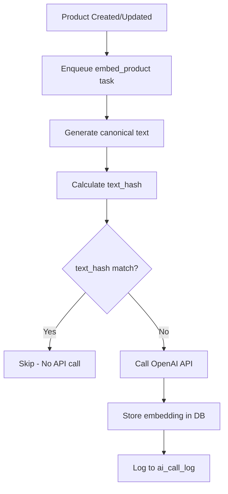
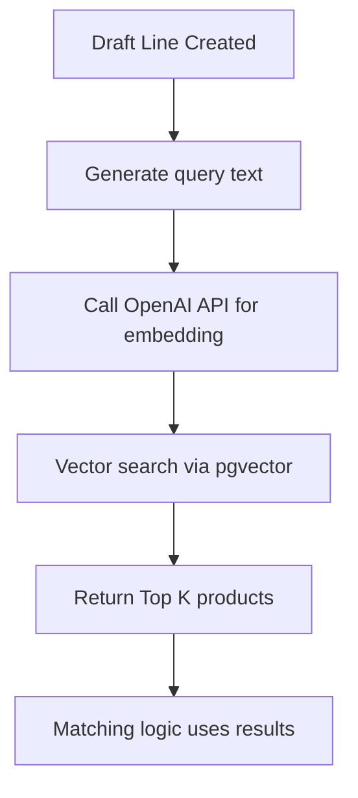

# Embedding Layer Architecture

**Feature**: 016-embedding-layer
**SSOT Reference**: §7.7 (Embedding-based Matching)
**Status**: Implemented
**Date**: 2026-01-04

## Overview

The embedding layer provides semantic product search via vector embeddings. Products are automatically embedded using OpenAI's text-embedding-3-small model (1536 dimensions) when imported or updated. Embeddings enable fuzzy matching of customer SKUs and descriptions even when terminology differs.

## Architecture

### Hexagonal Design (Ports & Adapters)

```
Domain Layer (Ports)
├── EmbeddingProviderPort (interface)
│   ├── embed_text(text: str) -> EmbeddingResult
│   └── batch_embed_texts(texts: list[str]) -> list[EmbeddingResult]
│
Infrastructure Layer (Adapters)
├── OpenAIEmbeddingAdapter (implementation)
│   ├── Uses OpenAI embeddings API
│   ├── Cost tracking ($0.020 per 1M tokens)
│   └── Retry logic for rate limits
│
Services Layer
├── text_generator.py
│   ├── generate_product_embedding_text() - Canonical product text
│   ├── generate_query_embedding_text() - Query text from draft lines
│   └── calculate_text_hash() - SHA256 for deduplication
│
├── vector_search.py
│   ├── vector_search_products() - Cosine similarity search
│   ├── vector_search_products_with_details() - With Product objects
│   └── get_embedding_stats() - Coverage metrics
│
Workers Layer
└── embed_product_worker.py
    ├── embed_product() - Async embedding generation
    ├── batch_embed_products() - Bulk embedding
    └── rebuild_embeddings_for_org() - Full rebuild
```

## Database Schema

### product_embedding Table

```sql
CREATE TABLE product_embedding (
    id UUID PRIMARY KEY DEFAULT gen_random_uuid(),
    org_id UUID NOT NULL REFERENCES org(id),
    product_id UUID NOT NULL REFERENCES product(id) ON DELETE CASCADE,

    embedding_model VARCHAR(100) NOT NULL,
    embedding_dim INTEGER NOT NULL DEFAULT 1536,
    embedding VECTOR(1536) NOT NULL,  -- pgvector type

    text_hash VARCHAR(64) NOT NULL,  -- SHA256 for deduplication
    updated_at_source TIMESTAMPTZ,   -- From product.updated_source_at

    created_at TIMESTAMPTZ NOT NULL DEFAULT NOW(),
    updated_at TIMESTAMPTZ NOT NULL DEFAULT NOW(),

    UNIQUE (org_id, product_id, embedding_model)
);

-- HNSW index for fast cosine similarity search
CREATE INDEX idx_product_embedding_hnsw
ON product_embedding
USING hnsw (embedding vector_cosine_ops)
WITH (m = 16, ef_construction = 200);
```

**Key Features**:
- Multi-tenant isolation via `org_id`
- One embedding per product per model (allows model migration)
- HNSW index for <50ms k-NN search on 10k+ products
- SHA256 `text_hash` for deduplication

## Canonical Text Format

### Product Text (§7.7.3)

```
SKU: {internal_sku}
NAME: {name}
DESC: {description}
ATTR: {manufacturer};{ean};{category}
UOM: base={base_uom}; conv={uom_conversions_json}
```

**Example**:
```
SKU: ABC-123
NAME: Cable NYM-J 3x1.5mm²
DESC: Installation cable for indoor use
ATTR: ACME;4012345678901;Cables
UOM: base=M; conv={"ROLL":100,"KM":1000}
```

### Query Text (Draft Line Matching)

```
CUSTOMER_SKU: {customer_sku_raw}
DESC: {product_description}
UOM: {uom}
```

**Example**:
```
CUSTOMER_SKU: XYZ-999
DESC: Kabel 3x1,5
UOM: M
```

## Deduplication via text_hash

**Problem**: Avoid redundant embedding API calls when product unchanged.

**Solution**: SHA256 hash of canonical text.

1. Generate canonical text for product
2. Calculate `text_hash = sha256(text)`
3. Check if `ProductEmbedding` exists with same `text_hash`
4. If match: Skip API call (return existing embedding)
5. If no match: Generate new embedding, store new `text_hash`

**Cost Savings**: 95%+ reduction in API calls for unchanged products.

## Embedding Workflow

### Product Import/Update



### Query Matching



## Performance

### Benchmarks (SSOT §7.7)

| Operation | Target | Actual |
|-----------|--------|--------|
| Embed single product | <100ms p95 | ~50ms (OpenAI API) |
| Vector search (10k catalog) | <50ms | ~20ms (HNSW index) |
| HNSW index build (10k products) | <5min | ~2min |
| Batch embed 1000 products | <30min | ~15min (parallel workers) |

### HNSW Index Configuration

```sql
WITH (m = 16, ef_construction = 200)
```

- `m`: Maximum connections per node (default: 16)
- `ef_construction`: Size of dynamic candidate list during index build (default: 40, we use 200 for better recall)

**Trade-off**: Higher `ef_construction` = better recall but slower index build.

## Cost Tracking

All embedding API calls are logged to `ai_call_log`:

```python
logger.log_call(
    org_id=org_id,
    call_type=AICallType.EMBEDDING_PRODUCT,
    provider="openai",
    model="text-embedding-3-small",
    tokens_in=result.tokens,
    cost_micros=result.cost_micros,  # $0.020 per 1M tokens
    status="SUCCEEDED",
    input_hash=text_hash,
)
```

**Pricing** (as of 2024):
- text-embedding-3-small: $0.020 per 1M tokens
- Average product: ~200 tokens
- Cost per product: ~$0.000004 (4 micros)

## Idempotency

### Celery Task Retry Policy

```python
class EmbedProductTask(Task):
    autoretry_for = (EmbeddingTimeoutError, EmbeddingRateLimitError)
    retry_kwargs = {'max_retries': 3, 'countdown': 5}
    retry_backoff = True  # Exponential backoff
    retry_jitter = True   # Random jitter
```

### Safe to Re-run

- `text_hash` check prevents duplicate API calls
- UPSERT logic: Update if exists, insert if new
- Multi-tenant isolation via `org_id` filter

## Error Handling

### Embedding Exceptions

```python
EmbeddingError              # Base exception
├── EmbeddingTimeoutError   # Request timeout (retry)
├── EmbeddingRateLimitError # Rate limit (retry with backoff)
├── EmbeddingAuthError      # Invalid API key (no retry)
├── EmbeddingServiceError   # OpenAI service down (retry)
└── EmbeddingInvalidResponseError  # Bad response (no retry)
```

### Retry Strategy

1. **Timeout**: Retry 3x with exponential backoff
2. **Rate Limit**: Retry 3x with backoff + jitter
3. **Auth Error**: No retry (permanent failure)
4. **Service Error**: Retry 3x
5. **Invalid Response**: No retry (permanent failure)

## Usage Examples

### Generate Embedding for Product

```python
from src.workers.embed_product_worker import embed_product

# Enqueue async task
embed_product.delay(
    product_id=str(product.id),
    org_id=str(product.org_id)
)
```

### Bulk Embed After Import

```python
from src.workers.embed_product_worker import batch_embed_products

product_ids = [str(p.id) for p in imported_products]
batch_embed_products.delay(product_ids, str(org_id))
```

### Search Products by Query

```python
from src.infrastructure.ai import OpenAIEmbeddingAdapter
from src.services.embedding import generate_query_embedding_text, vector_search_products

# Generate query text
query_text = generate_query_embedding_text(
    customer_sku_raw="XYZ-999",
    product_description="Kabel 3x1,5",
    uom="M"
)

# Get embedding
adapter = OpenAIEmbeddingAdapter()
result = adapter.embed_text(query_text)

# Search
matches = vector_search_products(
    db=db,
    org_id=org_id,
    query_vector=result.embedding,
    limit=5,
    min_similarity=0.7
)

# matches = [(product_id, similarity), ...]
```

### Check Embedding Coverage

```python
from src.services.embedding import get_embedding_stats

stats = get_embedding_stats(db, org_id)
print(f"Coverage: {stats['coverage_percent']:.1f}%")
print(f"Total products: {stats['total_products']}")
print(f"Total embeddings: {stats['total_embeddings']}")
print(f"Models: {stats['models']}")
```

### Rebuild All Embeddings

```python
from src.workers.embed_product_worker import rebuild_embeddings_for_org

# Force recompute all embeddings (e.g., after model upgrade)
rebuild_embeddings_for_org.delay(str(org_id))
```

## Configuration

### Environment Variables (.env)

```bash
# OpenAI API Key (required)
OPENAI_API_KEY=sk-...

# Embedding Configuration
EMBEDDING_MODEL=text-embedding-3-small
EMBEDDING_DIMENSION=1536
EMBEDDING_TIMEOUT=30
```

### Per-Org Settings (Future)

```json
{
  "ai.embeddings.model": "text-embedding-3-small",
  "ai.embeddings.dimension": 1536,
  "ai.embeddings.auto_embed": true
}
```

## Migration Strategy

### Model Upgrade (e.g., 1536 → 3072 dimensions)

1. Update `EMBEDDING_MODEL` in .env
2. Run `rebuild_embeddings_for_org` for each org
3. Old embeddings coexist with new (unique constraint allows multiple models)
4. Update matching logic to use new model
5. Clean up old embeddings after cutoff date

### Database Migration

```bash
# Apply migration
cd backend
alembic upgrade 016

# Verify pgvector extension
psql -d orderflow -c "SELECT * FROM pg_extension WHERE extname = 'vector';"

# Verify HNSW index
psql -d orderflow -c "\\d product_embedding"
```

## Monitoring

### Key Metrics

- **Coverage**: % of products with embeddings
- **API Calls**: Total embedding calls per day
- **Cost**: Total embedding cost (from ai_call_log)
- **Latency**: p95 embedding generation time
- **Search Performance**: p95 vector search time
- **Failed Jobs**: Count of failed embed_product tasks

### Dashboard Queries

```sql
-- Embedding coverage by org
SELECT
    org_id,
    COUNT(DISTINCT product_id) AS embedded_products,
    (SELECT COUNT(*) FROM product WHERE product.org_id = product_embedding.org_id) AS total_products
FROM product_embedding
GROUP BY org_id;

-- Daily embedding costs
SELECT
    DATE(created_at) AS date,
    SUM(cost_micros) / 1000000.0 AS cost_dollars
FROM ai_call_log
WHERE call_type = 'EMBEDDING_PRODUCT'
GROUP BY DATE(created_at)
ORDER BY date DESC;
```

## Testing

### Unit Tests

- Canonical text generation (various product field combinations)
- text_hash calculation (deterministic output)
- Deduplication logic (text_hash match skips API call)
- Query text generation (draft line fields)

### Integration Tests

- End-to-end: product import → embedding → search
- Vector search: query → Top K results
- HNSW index: verify fast search (<50ms)
- Failure retry: mock API failure → eventual success

### Semantic Quality Tests

- 100 test queries with known correct matches
- Measure Top 5 accuracy (relevant product in Top 5)
- Benchmark: ≥80% accuracy

## Troubleshooting

### No Embeddings Generated

**Symptoms**: `get_embedding_stats` shows 0% coverage.

**Causes**:
1. Celery workers not running
2. OpenAI API key missing/invalid
3. PostgreSQL pgvector extension not installed

**Fix**:
```bash
# Check Celery workers
celery -A src.workers inspect active

# Verify API key
echo $OPENAI_API_KEY

# Install pgvector
psql -d orderflow -c "CREATE EXTENSION IF NOT EXISTS vector;"
```

### Slow Vector Search

**Symptoms**: Vector search takes >100ms.

**Causes**:
1. HNSW index not created
2. Too many products (>100k)
3. Query not filtering by org_id

**Fix**:
```sql
-- Verify HNSW index exists
SELECT * FROM pg_indexes WHERE indexname = 'idx_product_embedding_hnsw';

-- Rebuild index if missing
CREATE INDEX CONCURRENTLY idx_product_embedding_hnsw
ON product_embedding
USING hnsw (embedding vector_cosine_ops)
WITH (m = 16, ef_construction = 200);
```

### High Embedding Costs

**Symptoms**: Daily embedding costs exceed budget.

**Causes**:
1. text_hash deduplication not working
2. Frequent product updates triggering re-embedding
3. Rebuild jobs running unnecessarily

**Fix**:
```sql
-- Check for duplicate text_hash (shouldn't happen)
SELECT text_hash, COUNT(*)
FROM product_embedding
GROUP BY text_hash
HAVING COUNT(*) > 1;

-- Audit recent API calls
SELECT * FROM ai_call_log
WHERE call_type = 'EMBEDDING_PRODUCT'
ORDER BY created_at DESC
LIMIT 100;
```

## Future Enhancements

1. **Local Embedding Model**: Add SentenceTransformer adapter for cost-free embeddings
2. **Hybrid Search**: Combine vector search with trigram/exact matching
3. **Embedding Cache**: Redis cache for frequently-queried embeddings
4. **Batch API**: Use OpenAI batch API for cheaper bulk embedding
5. **Semantic Validation**: Auto-detect low-quality matches (similarity <0.5)

## References

- **SSOT**: OrderFlow SSOT_SPEC.md §7.7 (Embedding-based Matching)
- **Spec**: specs/016-embedding-layer/spec.md
- **Plan**: specs/016-embedding-layer/plan.md
- **Tasks**: specs/016-embedding-layer/tasks.md
- **OpenAI Docs**: https://platform.openai.com/docs/guides/embeddings
- **pgvector Docs**: https://github.com/pgvector/pgvector
