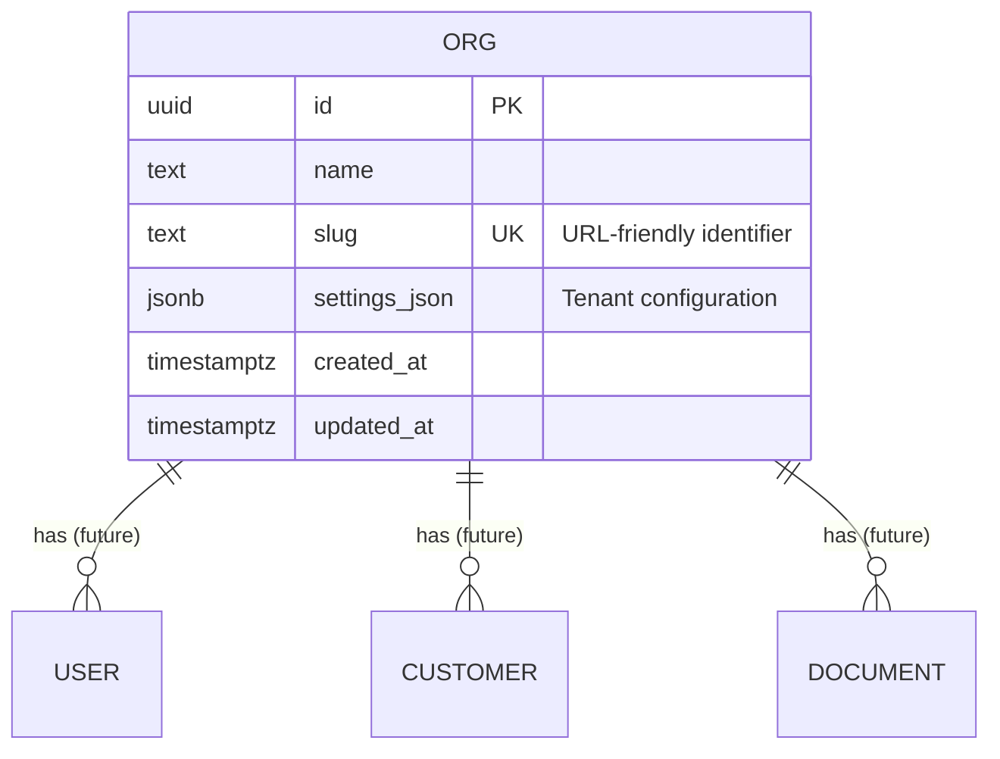

# Data Model: Platform Foundation

**Feature**: 001-platform-foundation
**Date**: 2025-12-27
**SSOT Reference**: §5.4.1 (org table), §5.1 (Conventions), §10.1 (Settings Schema)

## Overview

This feature establishes the foundational `org` table which serves as the tenant anchor for the entire multi-tenant system. Every other table in OrderFlow (except global system tables) will reference `org.id` via foreign key constraint.

## Entity Relationship Diagram



## Table Definitions

### org

**Purpose**: Represents a tenant organization in the multi-tenant system. Each organization has isolated data and configuration.

**Schema**:

```sql
CREATE TABLE org (
  id UUID PRIMARY KEY DEFAULT gen_random_uuid(),
  name TEXT NOT NULL,
  slug TEXT NOT NULL,
  settings_json JSONB NOT NULL DEFAULT '{}',
  created_at TIMESTAMPTZ NOT NULL DEFAULT NOW(),
  updated_at TIMESTAMPTZ NOT NULL DEFAULT NOW()
);

-- Indexes
CREATE UNIQUE INDEX idx_org_slug ON org(slug);

-- Trigger for automatic updated_at
CREATE OR REPLACE FUNCTION update_updated_at_column()
RETURNS TRIGGER AS $$
BEGIN
  NEW.updated_at = NOW();
  RETURN NEW;
END;
$$ LANGUAGE plpgsql;

CREATE TRIGGER update_org_updated_at
BEFORE UPDATE ON org
FOR EACH ROW
EXECUTE FUNCTION update_updated_at_column();
```

**Columns**:

| Column | Type | Nullable | Default | Description |
|--------|------|----------|---------|-------------|
| `id` | UUID | NOT NULL | gen_random_uuid() | Primary key, unique organization identifier |
| `name` | TEXT | NOT NULL | - | Human-readable organization name (e.g., "Acme GmbH") |
| `slug` | TEXT | NOT NULL | - | URL-friendly identifier (e.g., "acme-gmbh"), unique across system |
| `settings_json` | JSONB | NOT NULL | {} | Tenant-specific configuration (see Settings Schema below) |
| `created_at` | TIMESTAMPTZ | NOT NULL | NOW() | Timestamp when org was created (UTC) |
| `updated_at` | TIMESTAMPTZ | NOT NULL | NOW() | Timestamp when org was last modified (UTC, auto-updated) |

**Constraints**:
- Primary Key: `id`
- Unique: `slug` (enforced via unique index)
- Check: `slug` should match pattern `^[a-z0-9-]+$` (enforced in application layer)
- Check: `name` length between 1 and 200 characters (enforced in application layer)

**Indexes**:
- `idx_org_slug` (UNIQUE): For fast lookup by slug during login/tenant routing

**Foreign Keys**: None (this is the root tenant table)

---

## Settings JSON Schema

**Source**: SSOT §10.1

The `settings_json` column stores tenant-specific configuration as a JSONB document. This allows flexible configuration without requiring schema migrations for every new setting.

### Full Schema Definition

```python
from pydantic import BaseModel, Field
from typing import Optional

class MatchingSettings(BaseModel):
    """SKU matching configuration"""
    auto_apply_threshold: float = Field(
        default=0.92,
        ge=0.0,
        le=1.0,
        description="Confidence threshold for automatic mapping application"
    )
    auto_apply_gap: float = Field(
        default=0.10,
        ge=0.0,
        le=1.0,
        description="Minimum gap between top candidate and runner-up"
    )

class CustomerDetectionSettings(BaseModel):
    """Customer detection configuration"""
    auto_select_threshold: float = Field(
        default=0.90,
        ge=0.0,
        le=1.0,
        description="Confidence threshold for automatic customer selection"
    )
    require_manual_review_if_multiple: bool = Field(
        default=True,
        description="Force manual review when multiple customer candidates exist"
    )

class AISettings(BaseModel):
    """AI provider and budget configuration"""
    llm_provider: str = Field(
        default="openai",
        description="LLM provider (openai, anthropic, local)"
    )
    llm_model: str = Field(
        default="gpt-4o-mini",
        description="Model identifier"
    )
    llm_budget_daily_usd: float = Field(
        default=10.0,
        ge=0.0,
        description="Daily budget cap in USD"
    )
    vision_enabled: bool = Field(
        default=True,
        description="Enable vision model for scanned PDFs"
    )
    vision_max_pages: int = Field(
        default=5,
        ge=1,
        description="Maximum pages to process with vision model"
    )
    embedding_provider: str = Field(
        default="openai",
        description="Embedding provider (openai, local)"
    )
    embedding_model: str = Field(
        default="text-embedding-3-small",
        description="Embedding model identifier"
    )

class ExtractionSettings(BaseModel):
    """Document extraction configuration"""
    min_text_coverage_for_rule: float = Field(
        default=0.8,
        ge=0.0,
        le=1.0,
        description="Minimum text coverage ratio to attempt rule-based extraction"
    )
    max_pages_rule_based: int = Field(
        default=10,
        ge=1,
        description="Maximum pages for rule-based extraction attempt"
    )
    llm_on_extraction_failure: bool = Field(
        default=True,
        description="Fallback to LLM if rule-based extraction fails"
    )

class OrgSettings(BaseModel):
    """Complete organization settings schema"""
    default_currency: str = Field(
        default="EUR",
        description="ISO 4217 currency code"
    )
    price_tolerance_percent: float = Field(
        default=5.0,
        ge=0.0,
        description="Acceptable price deviation percentage for validation"
    )
    require_unit_price: bool = Field(
        default=False,
        description="Require unit price in extracted orders"
    )

    # Nested configuration objects
    matching: MatchingSettings = Field(default_factory=MatchingSettings)
    customer_detection: CustomerDetectionSettings = Field(default_factory=CustomerDetectionSettings)
    ai: AISettings = Field(default_factory=AISettings)
    extraction: ExtractionSettings = Field(default_factory=ExtractionSettings)
```

### Example Settings JSON

```json
{
  "default_currency": "EUR",
  "price_tolerance_percent": 5.0,
  "require_unit_price": false,
  "matching": {
    "auto_apply_threshold": 0.92,
    "auto_apply_gap": 0.10
  },
  "customer_detection": {
    "auto_select_threshold": 0.90,
    "require_manual_review_if_multiple": true
  },
  "ai": {
    "llm_provider": "openai",
    "llm_model": "gpt-4o-mini",
    "llm_budget_daily_usd": 10.0,
    "vision_enabled": true,
    "vision_max_pages": 5,
    "embedding_provider": "openai",
    "embedding_model": "text-embedding-3-small"
  },
  "extraction": {
    "min_text_coverage_for_rule": 0.8,
    "max_pages_rule_based": 10,
    "llm_on_extraction_failure": true
  }
}
```

### Default Settings

When a new organization is created, it receives these default settings. The defaults are defined in the Pydantic schema field defaults.

---

## SQLAlchemy Model

**File**: `backend/src/models/org.py`

```python
from sqlalchemy import Column, String, Text, text
from sqlalchemy.dialects.postgresql import UUID, JSONB, TIMESTAMP
from sqlalchemy.orm import validates
from datetime import datetime
import re

from .base import Base

class Org(Base):
    __tablename__ = "org"

    id = Column(UUID(as_uuid=True), primary_key=True, server_default=text("gen_random_uuid()"))
    name = Column(Text, nullable=False)
    slug = Column(Text, nullable=False, unique=True)
    settings_json = Column(JSONB, nullable=False, server_default=text("'{}'::jsonb"))
    created_at = Column(
        TIMESTAMP(timezone=True),
        nullable=False,
        server_default=text("NOW()")
    )
    updated_at = Column(
        TIMESTAMP(timezone=True),
        nullable=False,
        server_default=text("NOW()"),
        onupdate=datetime.utcnow
    )

    @validates('slug')
    def validate_slug(self, key, value):
        """Ensure slug is URL-friendly"""
        if not re.match(r'^[a-z0-9-]+$', value):
            raise ValueError(
                "Slug must contain only lowercase letters, numbers, and hyphens"
            )
        if len(value) < 2 or len(value) > 100:
            raise ValueError("Slug must be between 2 and 100 characters")
        return value

    @validates('name')
    def validate_name(self, key, value):
        """Ensure name is not empty"""
        if not value or len(value.strip()) == 0:
            raise ValueError("Organization name cannot be empty")
        if len(value) > 200:
            raise ValueError("Organization name cannot exceed 200 characters")
        return value.strip()

    def __repr__(self):
        return f"<Org(id={self.id}, slug='{self.slug}', name='{self.name}')>"
```

---

## Alembic Migration

**File**: `backend/migrations/versions/001_create_org_table.py`

```python
"""Create org table

Revision ID: 001
Revises:
Create Date: 2025-12-27 10:00:00.000000

"""
from alembic import op
import sqlalchemy as sa
from sqlalchemy.dialects import postgresql

# revision identifiers, used by Alembic.
revision = '001'
down_revision = None
branch_labels = None
depends_on = None


def upgrade():
    # Ensure required extensions exist
    op.execute('CREATE EXTENSION IF NOT EXISTS "pgcrypto"')
    op.execute('CREATE EXTENSION IF NOT EXISTS "pg_trgm"')
    op.execute('CREATE EXTENSION IF NOT EXISTS "vector"')

    # Create updated_at trigger function
    op.execute("""
        CREATE OR REPLACE FUNCTION update_updated_at_column()
        RETURNS TRIGGER AS $$
        BEGIN
          NEW.updated_at = NOW();
          RETURN NEW;
        END;
        $$ LANGUAGE plpgsql;
    """)

    # Create org table
    op.create_table(
        'org',
        sa.Column('id', postgresql.UUID(as_uuid=True), server_default=sa.text('gen_random_uuid()'), nullable=False),
        sa.Column('name', sa.Text(), nullable=False),
        sa.Column('slug', sa.Text(), nullable=False),
        sa.Column('settings_json', postgresql.JSONB(astext_type=sa.Text()), server_default=sa.text("'{}'::jsonb"), nullable=False),
        sa.Column('created_at', sa.TIMESTAMP(timezone=True), server_default=sa.text('NOW()'), nullable=False),
        sa.Column('updated_at', sa.TIMESTAMP(timezone=True), server_default=sa.text('NOW()'), nullable=False),
        sa.PrimaryKeyConstraint('id')
    )

    # Create unique index on slug
    op.create_index('idx_org_slug', 'org', ['slug'], unique=True)

    # Create trigger for updated_at
    op.execute("""
        CREATE TRIGGER update_org_updated_at
        BEFORE UPDATE ON org
        FOR EACH ROW
        EXECUTE FUNCTION update_updated_at_column();
    """)


def downgrade():
    # Drop trigger
    op.execute('DROP TRIGGER IF EXISTS update_org_updated_at ON org')

    # Drop table (cascade would remove dependent data, but we use RESTRICT in FK constraints)
    op.drop_table('org')

    # Note: We don't drop extensions or functions as they may be used by other tables
    # Manual cleanup required if truly removing everything
```

---

## Multi-Tenant Conventions Applied

Following SSOT §5.1, this table establishes the conventions that ALL future tables must follow:

1. **UUID Primary Key**: `id UUID PRIMARY KEY DEFAULT gen_random_uuid()`
2. **Timestamps**: `created_at TIMESTAMPTZ NOT NULL DEFAULT NOW()`, `updated_at TIMESTAMPTZ NOT NULL DEFAULT NOW()`
3. **Auto-update trigger**: `updated_at` automatically updated on row modification

**Note**: The `org` table itself does NOT have `org_id` (it is the root). All other tables will have:
```sql
org_id UUID NOT NULL REFERENCES org(id) ON DELETE RESTRICT
```

---

## Data Validation Rules

### Slug Format

**Pattern**: `^[a-z0-9-]+$`

**Valid Examples**:
- `acme-gmbh`
- `test-org-123`
- `my-company`

**Invalid Examples**:
- `Acme_GmbH` (uppercase, underscore)
- `acme gmbh` (space)
- `acme.gmbh` (period)

**Enforcement**: Application layer (Pydantic + SQLAlchemy validator)

### Name Validation

- **Required**: Cannot be empty or whitespace-only
- **Max Length**: 200 characters
- **Character Set**: Any Unicode (supports international names)

### Settings JSON Validation

- **Required**: Cannot be NULL (default: `{}`)
- **Schema**: Validated against `OrgSettings` Pydantic model before persistence
- **Invalid JSON**: Rejected at API layer (400 Bad Request)
- **Unknown fields**: Allowed (forward compatibility) but ignored

---

## Sample Data

### Minimal Org (for testing)

```sql
INSERT INTO org (name, slug, settings_json)
VALUES (
  'Acme GmbH',
  'acme-gmbh',
  '{}'  -- Uses all default settings
);
```

### Org with Custom Settings

```sql
INSERT INTO org (name, slug, settings_json)
VALUES (
  'Swiss Trading AG',
  'swiss-trading',
  '{
    "default_currency": "CHF",
    "price_tolerance_percent": 3.0,
    "matching": {
      "auto_apply_threshold": 0.95
    },
    "ai": {
      "llm_budget_daily_usd": 20.0
    }
  }'
);
```

---

## Testing Checklist

### Schema Tests

- [ ] Verify `org` table exists
- [ ] Verify all columns have correct types
- [ ] Verify `id` is UUID with default gen_random_uuid()
- [ ] Verify `slug` has unique constraint
- [ ] Verify `created_at` and `updated_at` have DEFAULT NOW()
- [ ] Verify trigger updates `updated_at` on row modification
- [ ] Verify PostgreSQL extensions (pgcrypto, pg_trgm, vector) are installed

### Model Tests

- [ ] Create org with valid data succeeds
- [ ] Create org with duplicate slug fails (IntegrityError)
- [ ] Slug validation rejects invalid formats
- [ ] Name validation rejects empty/whitespace-only names
- [ ] Settings JSON defaults to `{}` when not provided
- [ ] Settings JSON can be queried with JSONB operators

### Migration Tests

- [ ] `alembic upgrade head` succeeds on empty database
- [ ] `alembic downgrade -1` successfully rolls back org table
- [ ] Re-running `alembic upgrade head` is idempotent

---

## Future Extensions

When implementing future features that reference `org`, follow this pattern:

```sql
CREATE TABLE example (
  id UUID PRIMARY KEY DEFAULT gen_random_uuid(),
  org_id UUID NOT NULL REFERENCES org(id) ON DELETE RESTRICT,
  -- other columns
  created_at TIMESTAMPTZ NOT NULL DEFAULT NOW(),
  updated_at TIMESTAMPTZ NOT NULL DEFAULT NOW()
);

CREATE INDEX idx_example_org ON example(org_id);

CREATE TRIGGER update_example_updated_at
BEFORE UPDATE ON example
FOR EACH ROW
EXECUTE FUNCTION update_updated_at_column();
```

**Key Points**:
- `ON DELETE RESTRICT`: Prevent org deletion if dependent data exists
- Index on `org_id`: Fast tenant filtering
- Reuse `update_updated_at_column()` trigger function (already created in this migration)
