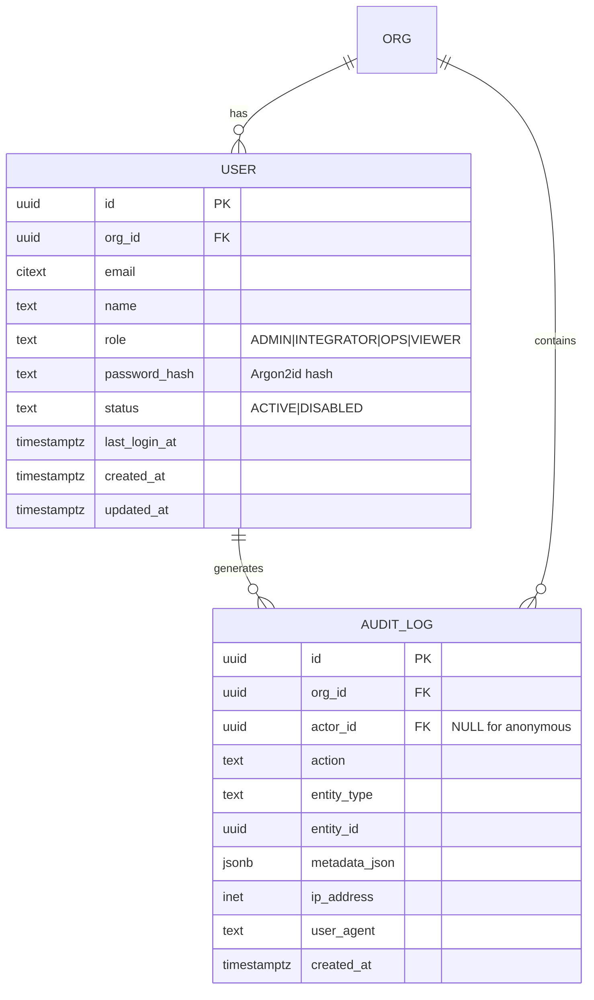

# Data Model: Authentication & RBAC

**Feature**: 002-auth-rbac
**Date**: 2025-12-27
**SSOT Reference**: §5.4.2 (user table), §5.4.16 (audit_log table), §5.2.1 (Roles)

## Entity Relationship Diagram



## Table Definitions

### user

**Purpose**: Represents authenticated users who can access the OrderFlow system. Each user belongs to one organization and has a specific role determining their permissions.

**Schema**:

```sql
CREATE TABLE "user" (
  id UUID PRIMARY KEY DEFAULT gen_random_uuid(),
  org_id UUID NOT NULL REFERENCES org(id) ON DELETE RESTRICT,
  email CITEXT NOT NULL,
  name TEXT NOT NULL,
  role TEXT NOT NULL CHECK (role IN ('ADMIN', 'INTEGRATOR', 'OPS', 'VIEWER')),
  password_hash TEXT NOT NULL,
  status TEXT NOT NULL DEFAULT 'ACTIVE' CHECK (status IN ('ACTIVE', 'DISABLED')),
  last_login_at TIMESTAMPTZ,
  created_at TIMESTAMPTZ NOT NULL DEFAULT NOW(),
  updated_at TIMESTAMPTZ NOT NULL DEFAULT NOW(),
  UNIQUE (org_id, email)
);

CREATE INDEX idx_user_org_role ON "user"(org_id, role);
CREATE INDEX idx_user_email ON "user"(email);  -- For login lookup

CREATE TRIGGER update_user_updated_at
BEFORE UPDATE ON "user"
FOR EACH ROW
EXECUTE FUNCTION update_updated_at_column();
```

**Columns**:

| Column | Type | Nullable | Default | Description |
|--------|------|----------|---------|-------------|
| `id` | UUID | NOT NULL | gen_random_uuid() | Primary key |
| `org_id` | UUID | NOT NULL | - | Organization (tenant) this user belongs to |
| `email` | CITEXT | NOT NULL | - | Email address (case-insensitive, unique per org) |
| `name` | TEXT | NOT NULL | - | User's display name |
| `role` | TEXT | NOT NULL | - | ADMIN, INTEGRATOR, OPS, or VIEWER |
| `password_hash` | TEXT | NOT NULL | - | Argon2id hash of password+pepper |
| `status` | TEXT | NOT NULL | ACTIVE | ACTIVE or DISABLED |
| `last_login_at` | TIMESTAMPTZ | NULL | NULL | Last successful login timestamp |
| `created_at` | TIMESTAMPTZ | NOT NULL | NOW() | User creation timestamp |
| `updated_at` | TIMESTAMPTZ | NOT NULL | NOW() | Last modification timestamp |

**Constraints**:
- UNIQUE (`org_id`, `email`): Same email can exist in different orgs
- CHECK (`role` IN ('ADMIN', 'INTEGRATOR', 'OPS', 'VIEWER'))
- CHECK (`status` IN ('ACTIVE', 'DISABLED'))

**Indexes**:
- `idx_user_org_role`: Query users by org and role
- `idx_user_email`: Fast login lookup

---

### audit_log

**Purpose**: Immutable log of security-relevant events for compliance, auditing, and forensics.

**Schema**:

```sql
CREATE TABLE audit_log (
  id UUID PRIMARY KEY DEFAULT gen_random_uuid(),
  org_id UUID NOT NULL REFERENCES org(id) ON DELETE RESTRICT,
  actor_id UUID REFERENCES "user"(id) ON DELETE SET NULL,
  action TEXT NOT NULL,
  entity_type TEXT,
  entity_id UUID,
  metadata_json JSONB,
  ip_address INET,
  user_agent TEXT,
  created_at TIMESTAMPTZ NOT NULL DEFAULT NOW()
);

CREATE INDEX idx_audit_org_created ON audit_log(org_id, created_at DESC);
CREATE INDEX idx_audit_actor ON audit_log(actor_id, created_at DESC);
CREATE INDEX idx_audit_action ON audit_log(action, created_at DESC);
CREATE INDEX idx_audit_entity ON audit_log(entity_type, entity_id);
```

**Columns**:

| Column | Type | Nullable | Description |
|--------|------|----------|-------------|
| `id` | UUID | NOT NULL | Primary key |
| `org_id` | UUID | NOT NULL | Organization |
| `actor_id` | UUID | NULL | User who performed action (NULL for anonymous, e.g., failed login) |
| `action` | TEXT | NOT NULL | Event type (LOGIN_SUCCESS, USER_CREATED, etc.) |
| `entity_type` | TEXT | NULL | Type of entity affected (user, draft_order, etc.) |
| `entity_id` | UUID | NULL | ID of affected entity |
| `metadata_json` | JSONB | NULL | Additional context (old/new values, error details) |
| `ip_address` | INET | NULL | Client IP address |
| `user_agent` | TEXT | NULL | Client user agent |
| `created_at` | TIMESTAMPTZ | NOT NULL | Event timestamp |

**Audit Actions** (SSOT §11.4):
- `LOGIN_SUCCESS`, `LOGIN_FAILED`
- `USER_CREATED`, `USER_UPDATED`, `USER_DISABLED`
- `USER_ROLE_CHANGED`
- `PASSWORD_CHANGED`
- `PERMISSION_DENIED`

**Immutability**: No UPDATE or DELETE operations allowed (enforce in application layer).

---

## SQLAlchemy Models

### User Model

**File**: `backend/src/models/user.py`

```python
from sqlalchemy import Column, String, Text, ForeignKey, CheckConstraint
from sqlalchemy.dialects.postgresql import UUID, CITEXT, TIMESTAMP
from sqlalchemy.orm import relationship, validates
from datetime import datetime
import re

from .base import Base

class User(Base):
    __tablename__ = "user"

    id = Column(UUID(as_uuid=True), primary_key=True, server_default=text("gen_random_uuid()"))
    org_id = Column(UUID(as_uuid=True), ForeignKey("org.id", ondelete="RESTRICT"), nullable=False)
    email = Column(CITEXT, nullable=False)
    name = Column(Text, nullable=False)
    role = Column(Text, nullable=False)
    password_hash = Column(Text, nullable=False)
    status = Column(Text, nullable=False, server_default="ACTIVE")
    last_login_at = Column(TIMESTAMP(timezone=True), nullable=True)
    created_at = Column(TIMESTAMP(timezone=True), nullable=False, server_default=text("NOW()"))
    updated_at = Column(TIMESTAMP(timezone=True), nullable=False, server_default=text("NOW()"))

    # Relationships
    org = relationship("Org", back_populates="users")

    # Constraints
    __table_args__ = (
        CheckConstraint(
            role.in_(['ADMIN', 'INTEGRATOR', 'OPS', 'VIEWER']),
            name='ck_user_role'
        ),
        CheckConstraint(
            status.in_(['ACTIVE', 'DISABLED']),
            name='ck_user_status'
        ),
        UniqueConstraint('org_id', 'email', name='uq_user_org_email')
    )

    @validates('email')
    def validate_email(self, key, value):
        """Basic email format validation"""
        if not re.match(r'^[a-zA-Z0-9._%+-]+@[a-zA-Z0-9.-]+\.[a-zA-Z]{2,}$', value):
            raise ValueError("Invalid email format")
        return value.lower()

    def to_dict(self):
        return {
            "id": str(self.id),
            "org_id": str(self.org_id),
            "email": self.email,
            "name": self.name,
            "role": self.role,
            "status": self.status,
            "last_login_at": self.last_login_at.isoformat() if self.last_login_at else None,
            "created_at": self.created_at.isoformat(),
            "updated_at": self.updated_at.isoformat()
        }
```

### AuditLog Model

**File**: `backend/src/models/audit_log.py`

```python
from sqlalchemy import Column, String, Text, ForeignKey
from sqlalchemy.dialects.postgresql import UUID, JSONB, TIMESTAMP, INET
from sqlalchemy.orm import relationship

from .base import Base

class AuditLog(Base):
    __tablename__ = "audit_log"

    id = Column(UUID(as_uuid=True), primary_key=True, server_default=text("gen_random_uuid()"))
    org_id = Column(UUID(as_uuid=True), ForeignKey("org.id", ondelete="RESTRICT"), nullable=False)
    actor_id = Column(UUID(as_uuid=True), ForeignKey("user.id", ondelete="SET NULL"), nullable=True)
    action = Column(Text, nullable=False)
    entity_type = Column(Text, nullable=True)
    entity_id = Column(UUID(as_uuid=True), nullable=True)
    metadata_json = Column(JSONB, nullable=True)
    ip_address = Column(INET, nullable=True)
    user_agent = Column(Text, nullable=True)
    created_at = Column(TIMESTAMP(timezone=True), nullable=False, server_default=text("NOW()"))

    # Relationships
    org = relationship("Org")
    actor = relationship("User")

    def to_dict(self):
        return {
            "id": str(self.id),
            "org_id": str(self.org_id),
            "actor_id": str(self.actor_id) if self.actor_id else None,
            "action": self.action,
            "entity_type": self.entity_type,
            "entity_id": str(self.entity_id) if self.entity_id else None,
            "metadata": self.metadata_json,
            "ip_address": str(self.ip_address) if self.ip_address else None,
            "user_agent": self.user_agent,
            "created_at": self.created_at.isoformat()
        }
```

---

## Sample Data

### Create Test Users

```sql
-- Admin user
INSERT INTO "user" (org_id, email, name, role, password_hash, status)
VALUES (
  'org-uuid-here',
  'admin@acme.de',
  'Admin User',
  'ADMIN',
  '$argon2id$v=19$m=65536,t=3,p=4$...',  -- Hash of "password123"
  'ACTIVE'
);

-- OPS user
INSERT INTO "user" (org_id, email, name, role, password_hash, status)
VALUES (
  'org-uuid-here',
  'ops@acme.de',
  'Ops User',
  'OPS',
  '$argon2id$v=19$m=65536,t=3,p=4$...',
  'ACTIVE'
);

-- Viewer user
INSERT INTO "user" (org_id, email, name, role, password_hash, status)
VALUES (
  'org-uuid-here',
  'viewer@acme.de',
  'Viewer User',
  'VIEWER',
  '$argon2id$v=19$m=65536,t=3,p=4$...',
  'ACTIVE'
);
```

### Sample Audit Log Entries

```sql
-- Successful login
INSERT INTO audit_log (org_id, actor_id, action, metadata_json, ip_address, user_agent)
VALUES (
  'org-uuid',
  'user-uuid',
  'LOGIN_SUCCESS',
  '{"email": "admin@acme.de"}',
  '192.168.1.100',
  'Mozilla/5.0...'
);

-- Failed login (anonymous)
INSERT INTO audit_log (org_id, actor_id, action, metadata_json, ip_address)
VALUES (
  'org-uuid',
  NULL,  -- Anonymous
  'LOGIN_FAILED',
  '{"email": "attacker@evil.com", "reason": "invalid_password"}',
  '10.0.0.1'
);

-- User created by admin
INSERT INTO audit_log (org_id, actor_id, action, entity_type, entity_id, metadata_json)
VALUES (
  'org-uuid',
  'admin-user-uuid',
  'USER_CREATED',
  'user',
  'new-user-uuid',
  '{"email": "newuser@acme.de", "role": "OPS"}'
);
```

---

## Pydantic Schemas

```python
from pydantic import BaseModel, EmailStr, Field
from uuid import UUID
from datetime import datetime
from typing import Optional

class UserCreate(BaseModel):
    email: EmailStr
    name: str = Field(min_length=1, max_length=200)
    role: str = Field(pattern="^(ADMIN|INTEGRATOR|OPS|VIEWER)$")
    password: str = Field(min_length=8)

class UserUpdate(BaseModel):
    name: Optional[str] = Field(None, min_length=1, max_length=200)
    role: Optional[str] = Field(None, pattern="^(ADMIN|INTEGRATOR|OPS|VIEWER)$")
    status: Optional[str] = Field(None, pattern="^(ACTIVE|DISABLED)$")

class UserResponse(BaseModel):
    id: UUID
    org_id: UUID
    email: str
    name: str
    role: str
    status: str
    last_login_at: Optional[datetime]
    created_at: datetime
    updated_at: datetime

    class Config:
        from_attributes = True

class LoginRequest(BaseModel):
    org_slug: str
    email: EmailStr
    password: str

class LoginResponse(BaseModel):
    access_token: str
    token_type: str = "bearer"
    expires_in: int = 3600
```
