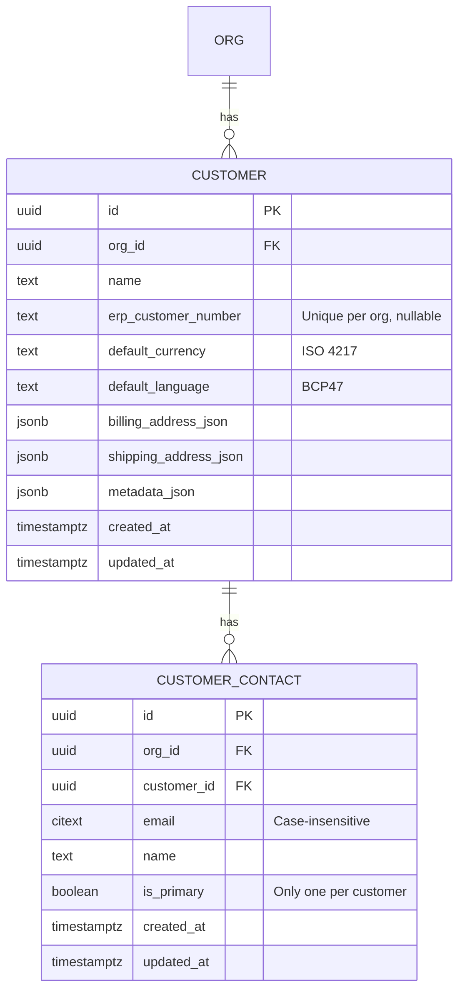

# Data Model: Customer Management

**Feature**: 004-customer-management
**Date**: 2025-12-27
**SSOT Reference**: §5.4.3 (customer), §5.4.4 (customer_contact)

## Entity Relationship Diagram



## Table Definitions

### customer

**Schema**:

```sql
CREATE TABLE customer (
  id UUID PRIMARY KEY DEFAULT gen_random_uuid(),
  org_id UUID NOT NULL REFERENCES org(id) ON DELETE RESTRICT,
  name TEXT NOT NULL,
  erp_customer_number TEXT,
  default_currency TEXT NOT NULL,
  default_language TEXT NOT NULL,
  billing_address_json JSONB,
  shipping_address_json JSONB,
  metadata_json JSONB,
  created_at TIMESTAMPTZ NOT NULL DEFAULT NOW(),
  updated_at TIMESTAMPTZ NOT NULL DEFAULT NOW(),
  UNIQUE (org_id, erp_customer_number) WHERE erp_customer_number IS NOT NULL
);

CREATE INDEX idx_customer_org_name ON customer(org_id, name);
CREATE INDEX idx_customer_org_erp ON customer(org_id, erp_customer_number);

CREATE TRIGGER update_customer_updated_at
BEFORE UPDATE ON customer
FOR EACH ROW
EXECUTE FUNCTION update_updated_at_column();
```

**Columns**:

| Column | Type | Nullable | Description |
|--------|------|----------|-------------|
| `id` | UUID | NOT NULL | Primary key |
| `org_id` | UUID | NOT NULL | Organization (tenant) |
| `name` | TEXT | NOT NULL | Customer business name |
| `erp_customer_number` | TEXT | NULL | Customer ID in ERP system (optional) |
| `default_currency` | TEXT | NOT NULL | ISO 4217 code (EUR, CHF, USD) |
| `default_language` | TEXT | NOT NULL | BCP47 code (de-DE, en-US) |
| `billing_address_json` | JSONB | NULL | Billing address |
| `shipping_address_json` | JSONB | NULL | Shipping address |
| `metadata_json` | JSONB | NULL | Custom fields |
| `created_at` | TIMESTAMPTZ | NOT NULL | Creation timestamp |
| `updated_at` | TIMESTAMPTZ | NOT NULL | Last update timestamp |

**Constraints**:
- UNIQUE (`org_id`, `erp_customer_number`) WHERE `erp_customer_number` IS NOT NULL

---

### customer_contact

**Schema**:

```sql
CREATE TABLE customer_contact (
  id UUID PRIMARY KEY DEFAULT gen_random_uuid(),
  org_id UUID NOT NULL REFERENCES org(id) ON DELETE RESTRICT,
  customer_id UUID NOT NULL REFERENCES customer(id) ON DELETE CASCADE,
  email CITEXT NOT NULL,
  name TEXT,
  is_primary BOOLEAN DEFAULT FALSE,
  created_at TIMESTAMPTZ NOT NULL DEFAULT NOW(),
  updated_at TIMESTAMPTZ NOT NULL DEFAULT NOW(),
  UNIQUE (customer_id, email)
);

CREATE INDEX idx_customer_contact_org_customer ON customer_contact(org_id, customer_id);
CREATE INDEX idx_customer_contact_email ON customer_contact(org_id, email);

CREATE TRIGGER update_customer_contact_updated_at
BEFORE UPDATE ON customer_contact
FOR EACH ROW
EXECUTE FUNCTION update_updated_at_column();
```

**Columns**:

| Column | Type | Nullable | Description |
|--------|------|----------|-------------|
| `id` | UUID | NOT NULL | Primary key |
| `org_id` | UUID | NOT NULL | Organization |
| `customer_id` | UUID | NOT NULL | Parent customer |
| `email` | CITEXT | NOT NULL | Contact email (case-insensitive) |
| `name` | TEXT | NULL | Contact person name |
| `is_primary` | BOOLEAN | NOT NULL | Primary contact flag |
| `created_at` | TIMESTAMPTZ | NOT NULL | Creation timestamp |
| `updated_at` | TIMESTAMPTZ | NOT NULL | Last update timestamp |

**Constraints**:
- UNIQUE (`customer_id`, `email`)
- ON DELETE CASCADE: Deleting customer deletes contacts

---

## SQLAlchemy Models

### Customer Model

```python
from sqlalchemy import Column, Text, ForeignKey, UniqueConstraint
from sqlalchemy.dialects.postgresql import UUID, JSONB, TIMESTAMP
from sqlalchemy.orm import relationship
from pydantic import BaseModel

class Customer(Base):
    __tablename__ = "customer"

    id = Column(UUID(as_uuid=True), primary_key=True, server_default=text("gen_random_uuid()"))
    org_id = Column(UUID(as_uuid=True), ForeignKey("org.id", ondelete="RESTRICT"), nullable=False)
    name = Column(Text, nullable=False)
    erp_customer_number = Column(Text, nullable=True)
    default_currency = Column(Text, nullable=False)
    default_language = Column(Text, nullable=False)
    billing_address_json = Column(JSONB, nullable=True)
    shipping_address_json = Column(JSONB, nullable=True)
    metadata_json = Column(JSONB, nullable=True)
    created_at = Column(TIMESTAMP(timezone=True), nullable=False, server_default=text("NOW()"))
    updated_at = Column(TIMESTAMP(timezone=True), nullable=False, server_default=text("NOW()"))

    # Relationships
    org = relationship("Org")
    contacts = relationship("CustomerContact", back_populates="customer", cascade="all, delete-orphan")

    __table_args__ = (
        UniqueConstraint('org_id', 'erp_customer_number', name='uq_customer_org_erp'),
    )
```

### CustomerContact Model

```python
from sqlalchemy import Column, Text, Boolean, ForeignKey
from sqlalchemy.dialects.postgresql import UUID, CITEXT, TIMESTAMP

class CustomerContact(Base):
    __tablename__ = "customer_contact"

    id = Column(UUID(as_uuid=True), primary_key=True, server_default=text("gen_random_uuid()"))
    org_id = Column(UUID(as_uuid=True), ForeignKey("org.id", ondelete="RESTRICT"), nullable=False)
    customer_id = Column(UUID(as_uuid=True), ForeignKey("customer.id", ondelete="CASCADE"), nullable=False)
    email = Column(CITEXT, nullable=False)
    name = Column(Text, nullable=True)
    is_primary = Column(Boolean, nullable=False, server_default="false")
    created_at = Column(TIMESTAMP(timezone=True), nullable=False, server_default=text("NOW()"))
    updated_at = Column(TIMESTAMP(timezone=True), nullable=False, server_default=text("NOW()"))

    # Relationships
    customer = relationship("Customer", back_populates="contacts")

    __table_args__ = (
        UniqueConstraint('customer_id', 'email', name='uq_contact_customer_email'),
    )
```

---

## Pydantic Schemas

```python
from pydantic import BaseModel, EmailStr, Field, validator
from uuid import UUID
from typing import Optional

class Address(BaseModel):
    street: Optional[str] = None
    street2: Optional[str] = None
    city: Optional[str] = None
    postal_code: Optional[str] = None
    state: Optional[str] = None
    country: Optional[str] = None  # ISO 3166-1 alpha-2

class CustomerCreate(BaseModel):
    name: str = Field(min_length=1, max_length=500)
    erp_customer_number: Optional[str] = Field(None, max_length=100)
    default_currency: str
    default_language: str
    billing_address: Optional[Address] = None
    shipping_address: Optional[Address] = None
    metadata: Optional[dict] = None

    @validator('default_currency')
    def validate_currency(cls, v):
        valid = ["EUR", "USD", "CHF", "GBP"]
        if v not in valid:
            raise ValueError(f"Invalid currency: {v}")
        return v

    @validator('default_language')
    def validate_language(cls, v):
        valid = ["de-DE", "en-US", "fr-FR", "it-IT"]
        if v not in valid:
            raise ValueError(f"Invalid language: {v}")
        return v

class CustomerContactCreate(BaseModel):
    email: EmailStr
    name: Optional[str] = None
    is_primary: bool = False

class CustomerResponse(BaseModel):
    id: UUID
    org_id: UUID
    name: str
    erp_customer_number: Optional[str]
    default_currency: str
    default_language: str
    billing_address: Optional[Address]
    shipping_address: Optional[Address]
    contacts: list[CustomerContact] = []
    created_at: datetime
    updated_at: datetime

    class Config:
        from_attributes = True
```

---

## Sample Data

```sql
-- Sample customer
INSERT INTO customer (org_id, name, erp_customer_number, default_currency, default_language, billing_address_json)
VALUES (
  'org-uuid',
  'Muster GmbH',
  '4711',
  'EUR',
  'de-DE',
  '{"street": "Musterstraße 1", "city": "München", "postal_code": "80331", "country": "DE"}'
);

-- Sample contact
INSERT INTO customer_contact (org_id, customer_id, email, name, is_primary)
VALUES (
  'org-uuid',
  'customer-uuid',
  'einkauf@muster.de',
  'Max Mustermann',
  true
);
```

---

## References

- SSOT §5.4.3: customer table
- SSOT §5.4.4: customer_contact table
