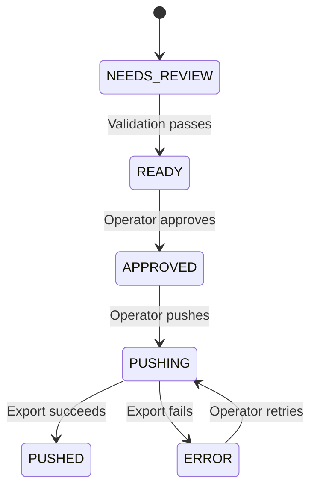
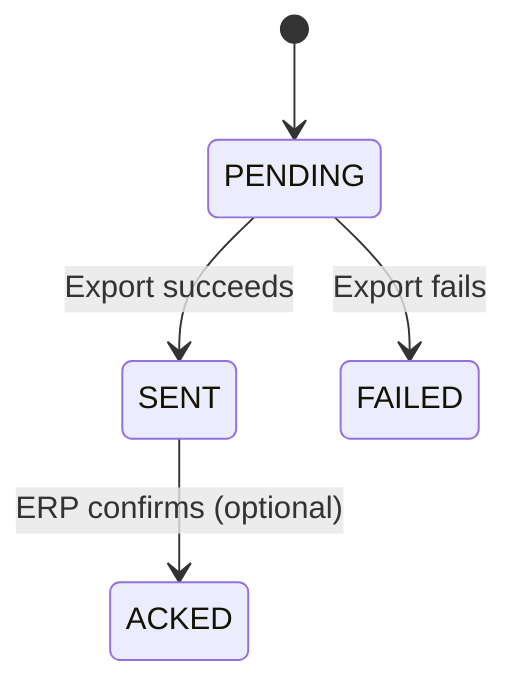

# Data Model: Approve & Push Flow

## Entity Definitions

### DraftOrder (Extended)

The DraftOrder entity is extended with approve and push tracking fields.

**Purpose**: Tracks draft approval state and links to export attempts.

**Schema Extensions**:
```python
class DraftOrder(Base):
    __tablename__ = "draft_order"

    # ... existing fields ...

    # Approval tracking
    status: Mapped[DraftOrderStatus] = mapped_column(
        Enum(DraftOrderStatus),
        nullable=False,
        default=DraftOrderStatus.NEEDS_REVIEW
    )
    approved_by_user_id: Mapped[UUID] = mapped_column(
        ForeignKey("user.id"),
        nullable=True
    )
    approved_at: Mapped[datetime] = mapped_column(
        nullable=True
    )

    # Relationships
    erp_exports: Mapped[list["ERPExport"]] = relationship(
        back_populates="draft_order",
        cascade="all, delete-orphan"
    )
```

**Status Values**:
- `NEEDS_REVIEW`: Draft requires operator attention
- `READY`: Validation passed, ready for approval
- `APPROVED`: Operator confirmed, ready for push
- `PUSHING`: Export job in progress
- `PUSHED`: Successfully exported to ERP
- `ERROR`: Export failed, retry available

---

### ERPExport

Represents a single export attempt to ERP via connector.

**Purpose**: Tracks export job lifecycle, links to draft and connector configuration.

**Schema**:
```python
class ERPExport(Base):
    __tablename__ = "erp_export"

    id: Mapped[UUID] = mapped_column(
        primary_key=True,
        default=uuid.uuid4
    )
    org_id: Mapped[UUID] = mapped_column(
        ForeignKey("organization.id"),
        nullable=False,
        index=True
    )

    # Links
    draft_order_id: Mapped[UUID] = mapped_column(
        ForeignKey("draft_order.id"),
        nullable=False,
        index=True
    )
    erp_connection_id: Mapped[UUID] = mapped_column(
        ForeignKey("erp_connection.id"),
        nullable=False
    )

    # Export metadata
    export_format_version: Mapped[str] = mapped_column(
        String(100),
        nullable=False,
        default="orderflow_export_json_v1"
    )
    status: Mapped[ERPExportStatus] = mapped_column(
        Enum(ERPExportStatus),
        nullable=False,
        default=ERPExportStatus.PENDING
    )

    # Export results
    export_storage_key: Mapped[str] = mapped_column(
        Text,
        nullable=True  # Set on success
    )
    dropzone_path: Mapped[str] = mapped_column(
        Text,
        nullable=True  # SFTP/FTP path if applicable
    )
    error_json: Mapped[dict] = mapped_column(
        JSONB,
        nullable=True,
        default=dict
    )

    # Tracking
    created_at: Mapped[datetime] = mapped_column(
        default=datetime.utcnow,
        nullable=False
    )
    sent_at: Mapped[datetime] = mapped_column(
        nullable=True  # Set when status = SENT
    )
    acked_at: Mapped[datetime] = mapped_column(
        nullable=True  # Set when ERP confirms receipt
    )

    # Relationships
    draft_order: Mapped["DraftOrder"] = relationship(back_populates="erp_exports")
    erp_connection: Mapped["ERPConnection"] = relationship()
```

**Status Values**:
- `PENDING`: Job queued, not yet processed
- `SENT`: Successfully written to dropzone/storage
- `ACKED`: ERP confirmed receipt (optional)
- `FAILED`: Export failed, error details in error_json

---

### AuditLog (Extended)

Audit log records approve and push actions.

**Purpose**: Compliance trail for operator actions and system events.

**Schema** (relevant fields):
```python
class AuditLog(Base):
    __tablename__ = "audit_log"

    id: Mapped[UUID] = mapped_column(primary_key=True, default=uuid.uuid4)
    org_id: Mapped[UUID] = mapped_column(ForeignKey("organization.id"), nullable=False, index=True)

    # Actor (NULL for system actions)
    actor_user_id: Mapped[UUID] = mapped_column(
        ForeignKey("user.id"),
        nullable=True
    )

    # Action type
    action: Mapped[str] = mapped_column(String(100), nullable=False, index=True)

    # Entity reference
    entity_type: Mapped[str] = mapped_column(String(50), nullable=True)
    entity_id: Mapped[UUID] = mapped_column(nullable=True, index=True)

    # Additional context
    details_json: Mapped[dict] = mapped_column(JSONB, nullable=True, default=dict)

    # Timestamp
    created_at: Mapped[datetime] = mapped_column(default=datetime.utcnow, nullable=False)
```

**Action Values for Approve/Push**:
- `DRAFT_APPROVED`: Operator approved draft
- `DRAFT_PUSHED`: Operator initiated push
- `DRAFT_PUSH_RETRIED`: Operator retried failed push
- `DRAFT_PUSH_FAILED`: Export worker failed
- `EXPORT_ACKED`: ERP acknowledged receipt (system action)

---

## Relationships

### DraftOrder ↔ ERPExport (One-to-Many)

A draft can have multiple export attempts (retries), but each export belongs to one draft.

```python
# DraftOrder
erp_exports: Mapped[list["ERPExport"]] = relationship(
    back_populates="draft_order",
    order_by="ERPExport.created_at.desc()"
)

# ERPExport
draft_order: Mapped["DraftOrder"] = relationship(back_populates="erp_exports")
```

**Query Latest Export**:
```python
latest_export = draft.erp_exports[0]  # Order by created_at DESC
```

---

### ERPExport → ERPConnection (Many-to-One)

Each export uses a specific connector configuration.

```python
# ERPExport
erp_connection: Mapped["ERPConnection"] = relationship()
```

**Query Active Connector**:
```python
connector = db.query(ERPConnection).filter_by(
    org_id=org_id,
    is_active=True
).first()
```

---

### AuditLog → User (Many-to-One, Optional)

Audit entries track actor for manual actions, NULL for system.

```python
# AuditLog
actor_user: Mapped["User"] = relationship()
```

**Query User Actions**:
```python
actions = db.query(AuditLog).filter_by(
    actor_user_id=user_id,
    action="DRAFT_APPROVED"
).all()
```

---

## Constraints

### Unique Constraints

**None** - Multiple exports per draft are allowed (retries).

### Check Constraints

```sql
-- Status transitions must be valid
ALTER TABLE draft_order ADD CONSTRAINT check_valid_status
CHECK (status IN ('NEEDS_REVIEW', 'READY', 'APPROVED', 'PUSHING', 'PUSHED', 'ERROR'));

-- Approved drafts must have approval metadata
ALTER TABLE draft_order ADD CONSTRAINT check_approval_metadata
CHECK (
    (status IN ('APPROVED', 'PUSHING', 'PUSHED') AND approved_by_user_id IS NOT NULL AND approved_at IS NOT NULL)
    OR
    (status NOT IN ('APPROVED', 'PUSHING', 'PUSHED'))
);

-- Export status must be valid
ALTER TABLE erp_export ADD CONSTRAINT check_export_status
CHECK (status IN ('PENDING', 'SENT', 'ACKED', 'FAILED'));

-- SENT exports must have storage key
ALTER TABLE erp_export ADD CONSTRAINT check_sent_has_storage
CHECK (
    (status = 'SENT' AND export_storage_key IS NOT NULL)
    OR
    (status != 'SENT')
);
```

### Indexes

```sql
-- Draft order status queries
CREATE INDEX idx_draft_order_status ON draft_order(org_id, status, created_at DESC);

-- Export lookup by draft
CREATE INDEX idx_erp_export_draft ON erp_export(draft_order_id, created_at DESC);

-- Export status queries
CREATE INDEX idx_erp_export_status ON erp_export(org_id, status, created_at DESC);

-- Audit log queries
CREATE INDEX idx_audit_log_entity ON audit_log(org_id, entity_type, entity_id, created_at DESC);
CREATE INDEX idx_audit_log_actor ON audit_log(org_id, actor_user_id, created_at DESC);
CREATE INDEX idx_audit_log_action ON audit_log(org_id, action, created_at DESC);
```

---

## State Machine

### DraftOrder Status Transitions



**Allowed Transitions**:
```python
ALLOWED_TRANSITIONS = {
    (DraftOrderStatus.READY, DraftOrderStatus.APPROVED),
    (DraftOrderStatus.APPROVED, DraftOrderStatus.PUSHING),
    (DraftOrderStatus.PUSHING, DraftOrderStatus.PUSHED),
    (DraftOrderStatus.PUSHING, DraftOrderStatus.ERROR),
    (DraftOrderStatus.ERROR, DraftOrderStatus.PUSHING),  # Retry
}
```

**Validation Function**:
```python
def validate_status_transition(from_status: DraftOrderStatus, to_status: DraftOrderStatus):
    if (from_status, to_status) not in ALLOWED_TRANSITIONS:
        raise ValueError(f"Invalid status transition: {from_status} → {to_status}")
```

---

### ERPExport Status Lifecycle



**Status Logic**:
- `PENDING`: Job created, worker not yet processed
- `SENT`: File written to dropzone, export complete
- `ACKED`: ERP webhook confirms receipt (implementation-dependent)
- `FAILED`: Worker caught exception, error in error_json

---

## Migration Strategy

### Alembic Migration (Draft Order Extensions)

```python
"""Add approval and export tracking to draft_order

Revision ID: 023_approve_push
Revises: 022_dropzone_connector
Create Date: 2025-12-27
"""

from alembic import op
import sqlalchemy as sa
from sqlalchemy.dialects.postgresql import UUID, JSONB

def upgrade():
    # Add approval tracking columns
    op.add_column('draft_order', sa.Column('approved_by_user_id', UUID, nullable=True))
    op.add_column('draft_order', sa.Column('approved_at', sa.TIMESTAMP(timezone=True), nullable=True))

    # Add foreign key
    op.create_foreign_key(
        'fk_draft_order_approved_by',
        'draft_order', 'user',
        ['approved_by_user_id'], ['id']
    )

    # Create erp_export table
    op.create_table(
        'erp_export',
        sa.Column('id', UUID, primary_key=True),
        sa.Column('org_id', UUID, sa.ForeignKey('organization.id'), nullable=False),
        sa.Column('draft_order_id', UUID, sa.ForeignKey('draft_order.id'), nullable=False),
        sa.Column('erp_connection_id', UUID, sa.ForeignKey('erp_connection.id'), nullable=False),
        sa.Column('export_format_version', sa.String(100), nullable=False),
        sa.Column('status', sa.String(50), nullable=False),
        sa.Column('export_storage_key', sa.Text, nullable=True),
        sa.Column('dropzone_path', sa.Text, nullable=True),
        sa.Column('error_json', JSONB, nullable=True),
        sa.Column('created_at', sa.TIMESTAMP(timezone=True), nullable=False),
        sa.Column('sent_at', sa.TIMESTAMP(timezone=True), nullable=True),
        sa.Column('acked_at', sa.TIMESTAMP(timezone=True), nullable=True)
    )

    # Create indexes
    op.create_index('idx_erp_export_draft', 'erp_export', ['draft_order_id', 'created_at'])
    op.create_index('idx_erp_export_status', 'erp_export', ['org_id', 'status', 'created_at'])

def downgrade():
    op.drop_table('erp_export')
    op.drop_column('draft_order', 'approved_at')
    op.drop_column('draft_order', 'approved_by_user_id')
```

---

## Example Queries

### Get Draft with Latest Export

```python
draft = db.query(DraftOrder).options(
    selectinload(DraftOrder.erp_exports)
).filter_by(id=draft_id, org_id=org_id).first()

latest_export = draft.erp_exports[0] if draft.erp_exports else None
```

### Get All Failed Exports for Retry

```python
failed_exports = db.query(ERPExport).join(DraftOrder).filter(
    DraftOrder.org_id == org_id,
    DraftOrder.status == DraftOrderStatus.ERROR,
    ERPExport.status == ERPExportStatus.FAILED
).order_by(ERPExport.created_at.desc()).all()
```

### Audit Trail for Draft

```python
audit_trail = db.query(AuditLog).filter(
    AuditLog.org_id == org_id,
    AuditLog.entity_type == "draft_order",
    AuditLog.entity_id == draft_id
).order_by(AuditLog.created_at.asc()).all()

# Returns sequence: DRAFT_APPROVED → DRAFT_PUSHED → EXPORT_ACKED
```

### Idempotency Check (Redis)

```python
import redis

redis_client = redis.Redis(host='localhost', port=6379, decode_responses=True)

def get_idempotent_export(draft_id: UUID, idempotency_key: str) -> UUID | None:
    key = f"idempotency:{draft_id}:{idempotency_key}"
    export_id = redis_client.get(key)
    return UUID(export_id) if export_id else None

def set_idempotent_export(draft_id: UUID, idempotency_key: str, export_id: UUID):
    key = f"idempotency:{draft_id}:{idempotency_key}"
    redis_client.setex(key, 24 * 3600, str(export_id))  # 24 hour TTL
```
